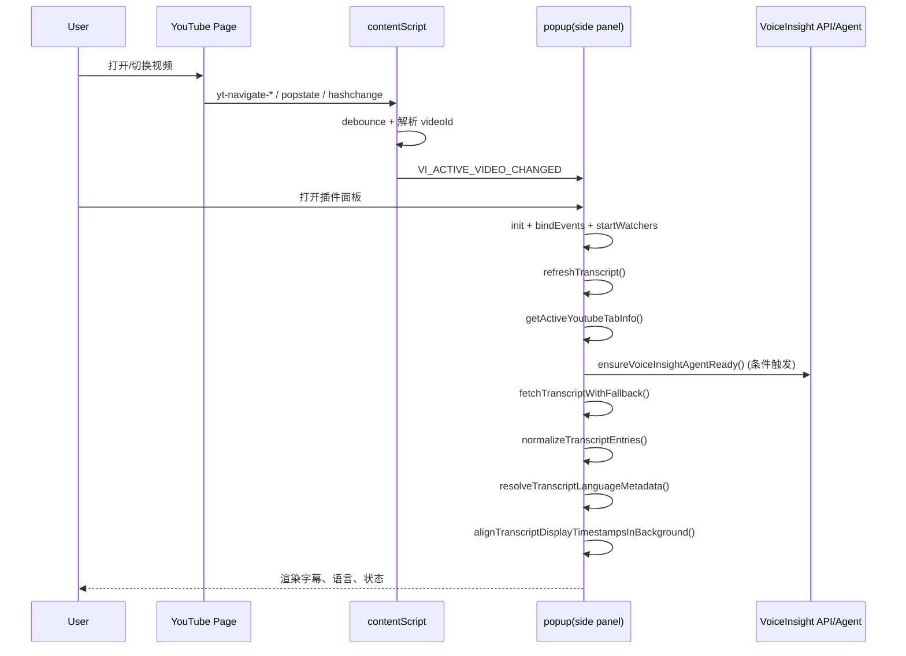
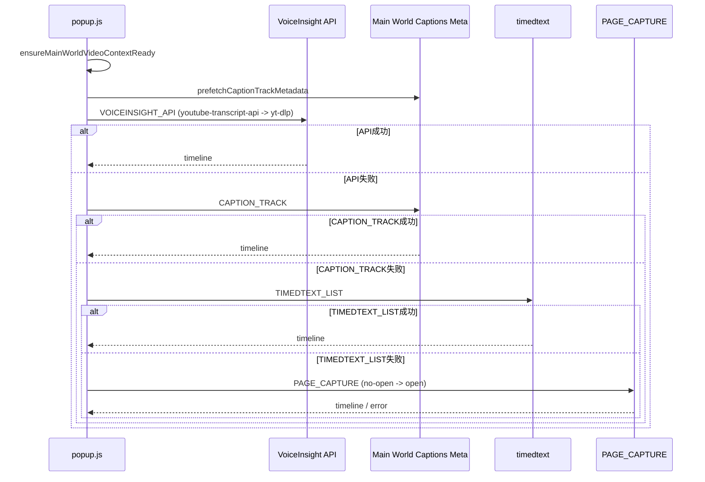

# VoiceInsight Architecture

> 本文档是 VoiceInsight 项目的长期架构主索引（Architecture Index）。  
> 目标：保持目录结构稳定、模块边界清晰、便于持续扩展（插件 / SaaS / Agent / 数据层等）。

---

## 0. 文档治理（长期稳定）

### 0.1 文档定位
- 本文档负责：
  - 全局架构分层与模块边界定义。
  - 各业务模块的技术方案入口索引。
  - 关键运行时序、排障手册、扩展规范的统一标准。
- 本文档不负责：
  - 详细需求说明（放在 PRD/Spec）。
  - 细粒度测试用例（放在 `docs/test-cases.md`）。
  - 每次迭代变更记录（放在 `docs/CHANGELOG.md`）。

### 0.2 目录稳定约定
- 一级章节（`0~8`）长期保持稳定，不随迭代随意改名。
- 新业务模块通过“新增二级章节”扩展，不破坏既有结构。
- 每个模块都必须包含：
  - `运行流程`
  - `失败排查`
  - `扩展接入规范`

### 0.3 当前范围
- 当前已完整梳理模块：**VoiceInsight 浏览器插件（YouTube 字幕提取）**。
- 预留模块（后续补充）：
  - VoiceInsight SaaS 平台
  - 任务调度与搜索抓取系统
  - 数据存储与分析层
  - 多渠道推送层（飞书 / 邮件 / 其他）

---

## 1. 全局架构地图（可扩展）

### 1.1 模块分层
1. **Client Layer**
   - Browser Extension（当前已实现）
   - Web App（SaaS 控制台，后续补充）
2. **Service Layer**
   - API Gateway / Auth / Subscription（后续补充）
   - Search Orchestrator（YouTube / Reddit / X，后续补充）
3. **Execution Layer**
   - Local Agent / Third-party Bridge（已在插件流程中使用）
   - Scheduler / Worker（后续补充）
4. **Data & Delivery Layer**
   - PostgreSQL / Redis / Object Storage（后续补充）
   - Feishu Webhook / Email / Notification（后续补充）

### 1.2 模块状态表
| 模块 | 状态 | 文档状态 |
| --- | --- | --- |
| Browser Extension | Active | 已详细梳理 |
| SaaS Platform | Planned | 预留结构 |
| Scheduler & Crawling | Planned | 预留结构 |
| Data Architecture | Planned | 预留结构 |
| Notification Delivery | Planned | 预留结构 |

---

## 2. Browser Extension（已落地）

### 2.1 模块目标与边界
- 目标：
  - 在 YouTube 视频页稳定提取字幕（多策略 fallback）。
  - 提供下载 / 复制 / 时间戳显示等用户操作。
  - 提供可复制的诊断日志，便于失败排查。
- 边界：
  - 插件只负责“提取与展示”，不负责 SaaS 订阅配置管理。
  - `contentScript` 与 `background` 不承载提取业务逻辑。

### 2.2 代码架构（当前真实实现）

#### 2.2.1 文件职责
- `packages/extension/manifest.json`
  - MV3 清单，声明 side panel、权限、content script 注入点。
- `packages/extension/background.js`
  - 仅负责 side panel 行为初始化。
- `packages/extension/contentScript.js`
  - 仅负责监听 YouTube SPA 导航并通知 popup 刷新。
- `packages/extension/popup.html`
  - 插件 UI 容器（按钮、列表、诊断区域）。
- `packages/extension/popup.shared.js`
  - 纯函数层：文本清洗、时间戳处理、导出格式、timedtext 解析。
- `packages/extension/popup.js`
  - 唯一业务编排核心：状态机、fallback 链路、诊断、导出下载。

#### 2.2.2 责任分离原则
- `popup.js` 是字幕提取唯一真源（single source of truth）。
- `popup.shared.js` 必须保持无副作用（side-effect free）。
- 禁止在 `contentScript/background` 中新增提取解析逻辑。

### 2.3 核心业务流程

#### 2.3.1 用户主流程（插件打开到拿到字幕）
1. 用户打开 YouTube 视频页面。
2. `contentScript` 捕获路由变化，发送 `VI_ACTIVE_VIDEO_CHANGED`。
3. 用户点击扩展图标，side panel 打开 `popup.html`。
4. `popup.js:init()` 绑定事件、初始化语言、启动监听、触发首次刷新。
5. `refreshTranscript()` 执行提取编排：
   - 获取当前 tab + videoId
   - 检查本地 Agent（仅 local API base 时）
   - 执行 fallback chain
   - 归一化字幕 + 语言识别 + 时间戳对齐
   - 渲染 UI
6. 用户可执行：
   - 下载（TXT/SRT/VTT）
   - 复制字幕
   - 手动刷新

### 2.4 时序图（Sequence）

#### 2.4.1 自动刷新主时序

#### 2.4.2 提取 fallback 时序

### 2.5 Fallback 设计要点
- 固定顺序：
  1. `VOICEINSIGHT_API`
  2. `CAPTION_TRACK`
  3. `TIMEDTEXT_LIST`
  4. `PAGE_CAPTURE`
- 关键机制：
  - 上下文门控（避免页面视频 ID 错位时误提取）。
  - 提取质量判定（低覆盖/脏文本可触发降级重试）。
  - 引擎退避（engine cooldown/backoff）。
  - Cookie bridge（API 命中 login_required 时，尝试携带浏览器 Cookie 重试）。

---

## 3. 失败排查手册（Runbook）

### 3.1 统一排查入口
1. 打开插件调试面板（连点 logo 解锁）。
2. 点击“复制诊断日志”。
3. 重点看三段信息：
   - `FALLBACK_CHAIN` 走到了哪一步失败
   - `VOICEINSIGHT_API / CAPTION_TRACK / PAGE_CAPTURE` 哪个先报错
   - 最终 `Diag Code` 和错误 key

### 3.2 常见失败场景
| 现象 | 可能原因 | 排查动作 |
| --- | --- | --- |
| 提示“请先打开 YouTube 页面” | 当前激活 tab 非 YouTube | 确认前台标签页 URL |
| API 经常超时 | 本地 Agent 不可用 / 网络慢 / 引擎卡住 | 检查 `/health`、看 `E-TP-TIMEOUT` |
| 命中 login_required | YouTube 触发登录或风控 | 观察 Cookie bridge 是否生效 |
| 页面字幕轨道为空 | 视频无字幕或区域限制 | 看 `no_caption_tracks / captions_not_found` |
| 切视频后拿到旧字幕 | SPA 切换上下文未稳定 | 看 `context_mismatch/context_not_ready` |
| 有字幕但时间错位 | 源数据时间锚点稀疏 | 查看 `TIMESTAMP_ALIGN` 日志 |

### 3.3 诊断码与处置建议（示例）
| 诊断码 | 含义 | 建议 |
| --- | --- | --- |
| `E-CTX-*` | 页面上下文不一致/未就绪 | 等页面稳定后手动刷新 |
| `E-TP-*` | 第三方 API/引擎链路异常 | 优先看 Agent、网络、依赖 |
| `E-TT-*` | timedtext 轨道读取异常 | 检查视频是否有公开字幕 |
| `E-CAP-*` | caption track 或页面入口异常 | 观察页面是否存在字幕入口 |
| `E-NO-SUBS` | 确认无可用字幕 | 换视频验证 |

### 3.4 快速分诊流程
1. 先判定“上下文问题”还是“字幕源问题”。
2. 若上下文正常，再看 fallback 最终停在哪个策略。
3. 只要 `PAGE_CAPTURE` 仍失败，优先考虑视频本身无可提取字幕或页面结构变化。
4. 将诊断日志与视频链接一起提交，避免只报“提取失败”。

---

## 4. 新策略接入规范（Extension）

> 适用于未来新增字幕提取策略（例如：新 API、新页面结构探测器）。

### 4.1 接入原则
1. 新策略只能接入 `popup.js` 的 fallback chain，不得分散到 `contentScript/background`。
2. 纯解析/格式化逻辑优先放入 `popup.shared.js`。
3. 必须可观测：每个阶段都要 `addDiagStep(stage, status, detail)`。
4. 必须可降级：策略失败不得阻断后续 fallback。

### 4.2 策略函数契约（建议）
- 输入：
  - `tabInfo`（tabId/videoId/url/title）
  - `options`（mode、language hints、超时预算等）
- 输出（成功）：
  - `transcript`
  - `timeline[]`（至少包含 `text` + 时间字段）
  - `languageCode/languageName`
  - `source/engine`
- 输出（失败）：
  - 抛出标准错误（可映射到现有 error key）

### 4.3 接入步骤（标准清单）
1. 在 fallback chain 注册新策略顺序与触发条件。
2. 新增日志 stage 命名（遵循统一命名风格）。
3. 补齐错误映射：
   - `mapTranscriptErrorKey`
   - `deriveErrorCode`
4. 更新业务日志文案（`buildBusinessLogMessages`）。
5. 更新本文档：
   - 策略顺序
   - 失败排查表新增该策略条目。

### 4.4 完成定义（DoD）
- 代码检查通过（语法、引用、lint）。
- 至少覆盖 3 类样例：
  1. 成功提取
  2. 可预期失败并正确降级
  3. 超时/异常不阻断后续链路
- 诊断日志可明确回答：
  - 是否进入了该策略
  - 为什么失败
  - 最终是否正确回退

---

## 5. 模块扩展模板（未来 SaaS/其他模块复用）

> 新模块请复制本模板节结构，不改动一级章节。

### 5.1 `<ModuleName>`（待补充）
- 目标与边界
- 代码结构与职责
- 核心运行时序（Mermaid）
- 失败排查手册
- 扩展接入规范
- 变更记录（可链接 CHANGELOG）

---

## 6. 关联文档索引

- 插件架构说明（实现侧）：`packages/extension/README.md`
- 产品规格：`docs/product-Specification.md`
- 开发计划：`docs/youtube_demo_dev_plan.md`
- 运行说明：`docs/running_instructions.md`
- 测试用例：`docs/test-cases.md`
- 变更记录：`docs/CHANGELOG.md`

---

## 7. 当前已知技术债（插件）

1. `popup.js` 仍较大，后续建议继续按领域拆分：
   - `pipeline`
   - `diagnostics`
   - `ui-render`
   - `integrations`
2. `PAGE_CAPTURE` 注入逻辑复杂，建议后续抽出独立文件并补最小回归测试。
3. 目前以 YouTube 为核心，Reddit/X 的插件侧能力尚未纳入本模块。

---

## 8. 架构变更记录（本文件）

- `2026-03-24`：
  - 初始化 `ARCHITECTURE.md` 稳定骨架。
  - 完整沉淀 Browser Extension 模块（时序图、排障手册、策略接入规范）。
  - 预留 SaaS 与其他业务模块扩展位。

