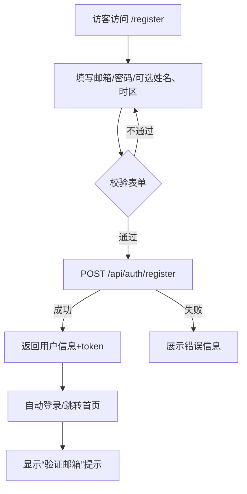
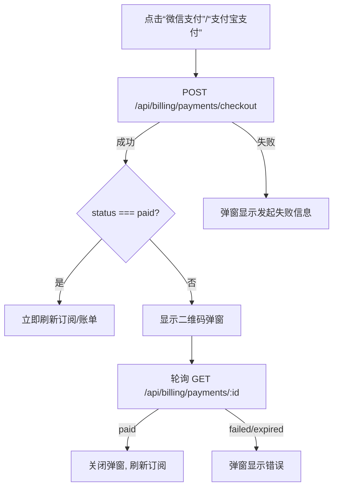
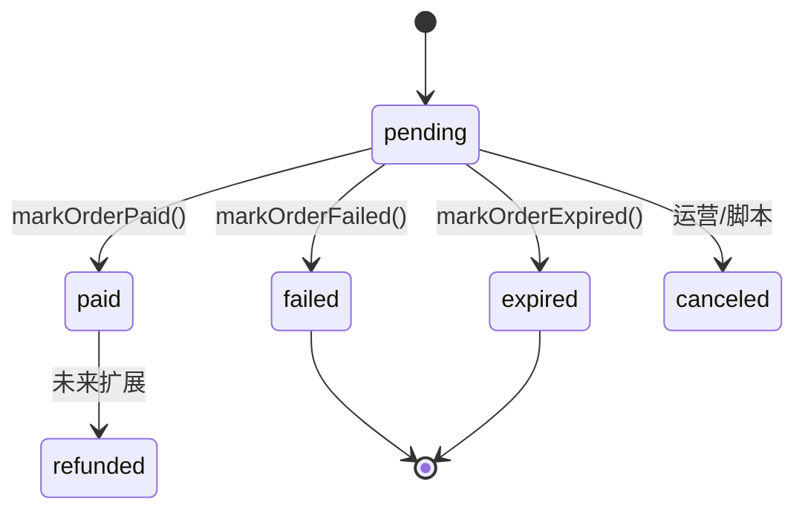

# Product Insight Demo — 产品功能规格说明书

> 文档版本：2025-11-01  
> 适用环境：当前 `Product_analysis` 仓库主分支  
> 目标：供产品、测试、研发、运维了解系统全部能力，并据此编写测试用例、开展验收与后续扩展

---

## 目录
1. [整体概述](#整体概述)
2. [角色与权限矩阵](#角色与权限矩阵)
3. [终端页面功能规格](#终端页面功能规格)
   - [3.1 Landing Page](#31-landing-page)
   - [3.2 认证与账号模块](#32-认证与账号模块)
   - [3.3 搜索控制台](#33-搜索控制台)
   - [3.4 订阅管理](#34-订阅管理)
4. [运营后台功能规格](#运营后台功能规格)
5. [支付与订阅后端流程](#支付与订阅后端流程)
6. [告警与通知体系](#告警与通知体系)
7. [定时任务与自动化](#定时任务与自动化)
8. [数据规格与约束](#数据规格与约束)
9. [环境配置要求](#环境配置要求)
10. [操作脚本与工具](#操作脚本与工具)
11. [非功能及质量要求](#非功能及质量要求)

---

## 整体概述
- **产品定位**：针对产品运营人员/客户成功团队的 SaaS Demo，用于追踪 YouTube、Reddit 等渠道的舆情反馈，结合订阅计费模型输出增值服务。
- **系统组成**：
  1. 前端 SPA（React+Vite），提供访客、用户、后台三个视图。
  2. 后端服务（Node.js + Express + Prisma + PostgreSQL），负责认证、搜索整合、支付、告警、定时任务。
  3. 外部依赖：YouTube Data API、Reddit API、SendGrid（邮件）、Slack Webhook、微信/支付宝支付（可选）。
- **支持终端**：桌面端 Web（移动端未针对性适配）。

---

## 角色与权限矩阵

## 2. 角色与权限矩阵

> 注：系统自动化任务不属于用户角色，相关说明见“定时任务与自动化”章节。

| 角色         | 身份来源/鉴权方式                                | 可访问内容                                                   | 受限内容                                   |
|--------------|---------------------------------------------------|--------------------------------------------------------------|--------------------------------------------|
| 访客         | 未登录                                            | Landing Page、注册、登录、忘记密码                          | 搜索控制台、订阅、后台                     |
| 注册用户     | 登录后持有 `accessToken`；邮箱验证状态记录在用户表 | 搜索控制台、订阅管理、支付、账单、登出                      | 后台接口；邮箱未验证时禁止创建订阅/支付   |
| 管理员/运营  | 请求头携带 `x-admin-token=ADMIN_TOKEN`            | `/admin` 后台各标签页、订单手动处理、告警查看               | 仅内部使用，普通用户不可访问              |

---

## 终端页面功能规格

### 3.1 Landing Page
- **路径**：`/`
- **内容**：产品介绍、CTA 按钮（登录/注册/立即体验）。
- **交互**：纯静态展示，无表单提交。
- **测试要点**：
  - 页面可访问，加载无报错。
  - CTA 跳转至 `/login`、`/register`、`/app`。

### 3.2 认证与账号模块

#### 3.2.1 注册流程



**字段规格**ia'l接下来我们梳理一下搜索控制台的详细产品规格和技术方案接下来我们梳理一下搜索控制台的详细产品规格和技术方案接下来我们梳理一下搜索控制台的详细产品规格和技术方案接下来我们梳理一下搜索控制台的详细产品规格和技术方案

**注册成功副作用**
1. `users` 表写入记录：
   - `status=trialing`，`trial_ends_at=当前时间+1天`。
   - `email_verified_at=NULL`。
2. 创建 `user_profiles` 记录（若填写姓名/时区）。
3. 调用 `sendMail()` 发送验证邮件（主题、内容详见邮件模板）。
4. 下发 `accessToken`（JWT）和 `refreshToken`（存表）。

**错误场景**
- 邮箱已被注册 → 返回 409 “邮箱已被注册”。
- 邮件发送失败 → 前端显示“注册成功但邮件可能未送达”，日志记录 `[mail]` 错误。

#### 3.2.2 登录流程

```mermaid
flowchart TD
  A[/login 页面] --> B[输入邮箱/密码]
  B --> C{校验格式}
  C -- 失败 --> B
  C -- 成功 --> D[POST /api/auth/login]
  D -->|成功| E[更新 AuthContext, redirect /app]
  D -->|失败| F[提示“邮箱或密码错误”]
```

**校验**
- 邮箱格式、密码非空。
- 后端使用 `verifyPassword` (bcrypt)。

**登录成功后**
- 若 `email_verified_at` 为空，前端账号横幅提示“邮箱未验证，前往验证”。
- 生成新的 access/refresh token；原 token 不失效。

#### 3.2.3 邮箱验证
- 注册后或手动访问 `/verify-email` 页面均提示“已向 xxx 发送验证邮件”。
- 验证链接格式：`/email/verify?token=<signed_token>`。
- 令牌结构：`{ userId, type: "email_verification", expiresAt }`，有效期 24 小时。
- 点击验证：
  1. 前端调用 `POST /api/auth/email/verify`，若成功返回最新用户信息。
  2. 更新 `users.email_verified_at=NOW()`。
  3. 将用户状态同步（若试用过期则状态可能变为 `past_due`）。
- “重新发送验证邮件”按钮调用 `POST /api/auth/email/resend`（无返回体）。
  - 若用户不存在/已验证，接口静默返回 204。

#### 3.2.4 忘记密码 & 重置
- 忘记密码页 `/password/forgot`：
  - 仅输入邮箱，调用 `POST /api/auth/password/reset/request`，始终返回 204。
  - 邮件中包含 `token`（类型 `password_reset`，24 小时内有效）。
- 重置页 `/password/reset?token=`：
  - 输入新密码（同注册规则），提交 `POST /api/auth/password/reset/confirm`。
  - 成功后所有 refresh token 会被设置 `revoked=true`，要求重新登录。

#### 3.2.5 退出登录
- “退出登录”按钮执行：
  - `POST /api/auth/logout`（带 refreshToken）。
  - 无论接口是否成功，前端都会清理本地 token 并跳转登录页。

### 3.3 搜索控制台

#### 3.3.1 页面结构
1. 顶部品牌区：标题、副标题、平台状态提示。
2. 若已登录：
   - 展示邮箱、邮箱验证徽章、账户状态、试用倒计时。
   - “管理订阅”按钮跳转 `/app/subscription`。
   - “退出登录”按钮。
3. 若未登录：展示注册/登录 CTA。
4. 搜索区：包含平台切换（YouTube/Reddit）、搜索输入框、历史关键字列表。
5. 结果区：加载骨架、错误提示、结果列表、分页控件。

#### 3.3.2 搜索流程

```mermaid
flowchart TD
  A[选择平台 & 输入关键字] --> B[本地校验：关键字非空]
  B --> C[调用 useFeedbackSearch.search()]
  C --> D[GET /api/search]
  D -->|成功| E[更新结果列表 & 存储历史]
  D -->|失败| F[显示错误 & 平台状态=error]
```

**请求参数**
- `platform`：`youtube` / `reddit`。
- `query`：非空字符串（后端限制最大长度 200）。
- `cursor`：可选，上一页/下一页的游标。
- `limit`：可选，默认为 10。

**响应结构**
```json
{
  "platform": "youtube",
  "keyword": "Helio Strap",
  "items": [ { "id": "...", "title": "...", ... } ],
  "pageInfo": {
    "totalResults": 999,
    "resultsPerPage": 10,
    "nextCursor": "abc",
    "prevCursor": null,
    "raw": { "nextPageToken": "abc", "prevPageToken": null }
  }
}
```

**展示规则**
- 每条结果显示标题、作者/频道、发布时间、评论/浏览量（若提供）、平台图标、复制链接按钮。
- 复制成功/失败均有 toast。
- 历史关键字：最近 5 次按平台分组保存（本地存储），可单独清除。

**错误场景**
- 网络/第三方接口失败 → `statusMap[platform]='error'`，横幅 Pill 变红。
- 验证错误（如未支持的平台） → 返回 400 “INVALID_PLATFORM”。

### 3.4 订阅管理

#### 3.4.1 页面布局
1. **当前套餐卡片**：展示账户状态、试用/到期时间、配额信息。
2. **升级套餐面板**：展示所有套餐（由 `plans` 表驱动），每个套餐包含名称、价格、周期、描述、权限。
3. **支付弹窗**：在发起付费套餐时，以模态窗口显示支付信息及二维码。
4. **账单记录表**：列出所有发票（时间、金额、状态、描述）。

#### 3.4.2 套餐数据规则
- `plans` 表字段：
  - `code` 唯一，前端与支付接口使用该值（如 `starter`、`pro`）。
  - `price_cents=0` 表示免费套餐。
  - `limits` JSON 中约定字段：
    - `keywords`：数字或 `"unlimited"`。
    - `members`：数字或 `"unlimited"`。
    - `notifications`：数组，示例 `["email","slack","webhook"]`。
    - `exports`：布尔值。
- 只有 `is_active=true` 的套餐会返回给前端。

#### 3.4.3 免费套餐启用
- 点击“立即启用”调用 `POST /api/billing/subscription`，参数 `{ userId, planCode }`。
- 校验：用户必须已验证邮箱；未验证会返回 400。
- 创建流程：
  1. 若存在有效订阅，则将其标记 `canceled`。
  2. 创建新订阅记录、发票（金额 0，状态 `paid`）。
  3. 更新用户状态 `active`，`plan_expire_at=周期结束时间`。
  4. 发送订阅激活邮件。

#### 3.4.4 付费套餐支付



**前端限制**
- 当前套餐若已是目标套餐（`currentPlanCode === plan.code`）则禁用按钮。
- `actionState` 控制按钮 loading 状态防止重复点击。
- 弹窗关闭按钮 `stopCheckout()` 会中断轮询并清空状态。

---

## 运营后台功能规格

### 权限控制
- 所有请求需在 header 携带 `x-admin-token`，与后端 `.env` 中 `ADMIN_TOKEN` 完全一致。
- 前端可在 `.env.local` 配置 `VITE_ADMIN_TOKEN` 以自动携带；否则在后台页面输入令牌。

### 页面结构
1. 顶部标题 + “返回控制台”按钮。
2. 标签切换：**支付订单** / **订阅状态** / **告警**。

### 支付订单标签
- **接口**：`GET /api/admin/payments?status=`。
- **表格字段**：
  - 订单 ID（`out_trade_no`）
  - 状态（`pending/paid/failed/expired/refunded/canceled`）
  - 渠道（`wechat/alipay/mock`）
  - 金额（￥xx.xx）
  - 用户邮箱
  - 套餐名称
  - 更新时间（`updated_at`）
  - 操作（详见下文）
- **筛选**：状态下拉（全部 / pending / paid / failed / expired）。
- **操作**（仅在 `status=pending` 时启用）：
  1. **查单重试** → `POST /api/admin/payments/:orderId/retry`
     - 若第三方返回成功，将订单标记 `paid` 并刷新订阅。
     - 若仍在支付中，返回提示“订单仍在支付中”。
  2. **标记失败** → `POST /api/admin/payments/:orderId/fail`
     - 可输入原因（默认 `ADMIN_MARK_FAILED`），更新订单 + 触发告警。
  3. **标记过期** → `POST /api/admin/payments/:orderId/expire`
     - 同样接受原因（默认 `ADMIN_EXPIRE`），更新订单 + 触发告警。

### 订阅状态标签
- **接口**：`GET /api/admin/subscriptions`
- **表字段**：订阅 ID、邮箱、套餐名称、状态、当前周期结束时间、试用结束时间。
- 返回最新 50 条，按 `updated_at` 倒序。

### 告警标签
- **接口**：`GET /api/admin/alerts?severity=`
- **表字段**：级别、消息、来源、标签、触发次数、最后触发、最后通知、详情（展开 JSON）。
- **筛选**：severity=全部 / critical / warning / info。
- 告警数据来源 `alerts` 表，按 `last_triggered_at` 倒序。

---

## 支付与订阅后端流程

### 5.1 支付订单状态机



### 5.2 回调处理
- **微信回调**：`POST /api/billing/payments/notify/wechat`
  - 验签（使用平台证书）。
  - 读取 `resource.trade_state`：
    - `SUCCESS` → `markOrderPaid({ amountCents, notifyPayload })`
    - 其他 → `markOrderFailed({ reason: trade_state })`
  - 异常会触发 `notifyAlert('微信支付回调处理失败', severity=critical)`。

- **支付宝回调**：同理，验证签名后根据 `trade_status` 判断。

### 5.3 金额校验
- `markOrderPaid` 会比较三方回调金额与订单金额。
- 不一致 → 发送 `severity=critical` 告警并将订单标记 `failed`，记录 `last_error='AMOUNT_MISMATCH'`。

### 5.4 订阅生成
- 成功支付调用 `createSubscription({ userId, planCode })`：
  - 若用户已有有效订阅 → `status=canceled`。
  - 创建新订阅 `status=active`，周期结束时间依据套餐计费周期（月/年）。
  - 创建发票 `status=paid`，写入金额、描述。
  - 更新用户字段：`status=active`、`plan_id`、`plan_expire_at`。
  - 发送订阅激活邮件。

### 5.5 返回给前端
- `createPaymentOrder` 返回 `CheckoutResult`：
  - `orderId`、`status`、`provider`、金额、二维码信息。
- `GET /api/billing/payments/:orderId` 返回实时状态与关联套餐信息。

---

## 告警与通知体系

### 6.1 `alerts` 表字段

| 字段                | 含义                                          |
|---------------------|-----------------------------------------------|
| `id`                | UUID 主键                                     |
| `dedupe_key`        | 限频键，唯一约束                               |
| `message`           | 告警标题                                       |
| `severity`          | `info/warning/critical`                        |
| `tags`              | 字符串数组，示例 `['payment','failed']`        |
| `occurrences`       | 触发次数（每次去重命中则 +1）                  |
| `last_triggered_at` | 最近触发时间                                   |
| `last_notified_at`  | 最近发送通知时间（受限频影响）                 |
| `payload`           | JSON 结构体                                   |
| `source`            | 触发来源（如 `payment-service`、`scheduler`）  |

### 6.2 告警触发点
- 支付流程：失败、过期、金额不符。
- 支付回调：处理异常。
- Cron：关键词同步失败（critical）、订阅提醒失败（warning）。
- CLI `trigger-alert.ts`：手动发送 info 告警。

### 6.3 Slack 通知
- 通过 `ALERT_SLACK_WEBHOOK` 发送。
- 限频（默认 15 分钟，可通过 `throttleMinutes` 调整）。
- 消息格式：Emoji + 标题 + JSON payload。

### 6.4 邮件通知
- 定时任务使用 `sendMail` 发送每日摘要（可通过 `MAIL_SEND_EMPTY` 控制空数据时是否发送）。
- 注册/重置密码/订阅激活等邮件均使用 `mail/sender.ts`，provider 支持 SendGrid / SMTP / stub。

---

## 定时任务与自动化

### 7.1 关键词同步
- 默认开启（`CRON_ENABLED=true`）；Cron 表达式由 `CRON_SCHEDULE` 控制（例如 `0 9,12,15,18 * * *`）。
- 支持在 `.env` 配置多个关键词、平台：`CRON_KEYWORDS=Helio Strap,Amazfit`，`CRON_PLATFORMS=youtube,reddit`。
- 每次执行：
  - 调用 Provider 抓取最新内容（限制 `CRON_FETCH_LIMIT`，默认 10）。
  - 保存数据至 `feedback_items`；记录新旧数量。
  - 构建摘要邮件：新增/更新数量、时间范围等。
  - 调 `sendMail` 投递（mail 配置正确时发送；stub 模式打印日志）。
  - 将执行结果写入 `notify_jobs`（成功/失败、发送数量）。
  - 失败时调用 `notifyAlert('关键词同步定时任务失败', severity=critical)`。

### 7.2 订阅提醒
- 由 `billingReminderConfig` 控制是否启用、Cron 表达式、是否启动即跑。
- `runBillingReminderJob()` 内部统计试用即将到期、套餐即将到期的用户，发送提醒邮件。
- 成功在日志输出提醒数量，失败触发告警 `cron:billing-reminder:error`。

---

## 数据规格与约束

| 表                | 关键约束                                                         |
|-------------------|------------------------------------------------------------------|
| `users`           | `email` 唯一；`status` 枚举；删除用户会级联删除 profile、订阅、订单等。 |
| `user_subscriptions` | 外键引用 `users`、`plans`；`status` 枚举。                        |
| `payment_orders`  | `out_trade_no` 唯一；`provider` 枚举；`status` 枚举。             |
| `invoices`        | `payment_order_id` 唯一索引（可为空）；`status` 枚举。            |
| `alerts`          | `dedupe_key` 唯一。                                               |
| `notify_jobs`     | 索引 `(status, run_at desc)` 用于快速查询最近任务。                |
| `feedback_items`  | 复合唯一键 `(platform, external_id)`；索引支持按关键词/时间查询。 |

删除用户/订单等操作需要谨慎，可使用脚本 `reset-test-data.ts` 或 `delete-user-by-email.ts`。

---

## 环境配置要求

详尽的环境变量说明可参考 `docs/runbook-payment.md`，此处列出核心项：

1. **数据库**：`DATABASE_URL`（指向 Supabase 或其他 PostgreSQL），`SHADOW_DATABASE_URL`（Prisma 迁移用）。
2. **认证**：`AUTH_JWT_SECRET`、`AUTH_REFRESH_SECRET`、`AUTH_REFRESH_EXPIRES_IN` 等。
3. **邮件**：`MAIL_PROVIDER`、`MAIL_API_KEY`/`MAIL_SMTP_*`、`MAIL_FROM`、`MAIL_TO`。
4. **告警**：`ALERT_SLACK_WEBHOOK`（未设置时仅打印日志）。
5. **后台权限**：`ADMIN_TOKEN`；前端可选 `VITE_ADMIN_TOKEN`。
6. **支付**（可选）：
   - 微信：`WECHAT_PAY_MCHID`、`WECHAT_PAY_APPID`、`WECHAT_PAY_SERIAL`、`WECHAT_PAY_PRIVATE_KEY_PATH`、`WECHAT_PAY_API_V3_KEY`、`WECHAT_PAY_NOTIFY_URL` 等。
   - 支付宝：`ALIPAY_APP_ID`、`ALIPAY_PRIVATE_KEY_PATH`、`ALIPAY_PUBLIC_KEY_PATH`、`ALIPAY_NOTIFY_URL`、`ALIPAY_GATEWAY`。
7. **搜索 API**：`YOUTUBE_API_KEY`、`REDDIT_CLIENT_ID/SECRET/USERNAME/PASSWORD/USER_AGENT`。
8. **Cron**：`CRON_ENABLED`、`CRON_SCHEDULE`、`CRON_KEYWORDS`、`CRON_PLATFORMS`、`CRON_FETCH_LIMIT`、`CRON_TIMEZONE`、`CRON_RUN_ON_STARTUP`。

> 修改 `.env` 后需重启后端 `pnpm --filter server dev`。

---

## 操作脚本与工具

| 脚本                              | 作用说明                                                                                         |
|-----------------------------------|--------------------------------------------------------------------------------------------------|
| `seed-plans.ts`                   | 初始化套餐（starter/pro/enterprise 等），重复执行可更新描述与价格。                              |
| `list-payment-orders.ts`          | 输出订单列表，便于检查订单状态。                                                                |
| `retry-payment-order.ts`          | 对指定 `out_trade_no` 执行查单补单。                                                            |
| `expire-payment-orders.ts`        | 将超过过期时间的 pending 订单标记为 expired。                                                   |
| `scan-payment-anomalies.ts`       | 扫描最近 1 小时的失败/过期订单，打印结构化日志并触发告警。                                      |
| `mark-order-failed.ts`            | 创建 mock 订单并标记失败，验证告警链路。                                                       |
| `trigger-alert.ts`                | 手动发送 info 级别 Slack 告警。                                                                  |
| `delete-user-by-email.ts <email>` | 删除指定用户及关联数据。                                                                         |
| `reset-test-data.ts`              | 清空所有用户、订阅、订单、发票、告警、任务记录（慎用，常用于测试重置）。                         |
| `test-db.ts`                      | 快速检查数据库连接是否可用。                                                                    |

运行方式统一：  
`pnpm --filter server exec tsx scripts/<script>.ts [参数]`

---

## 非功能及质量要求

1. **兼容性**：建议使用最新 Chrome/Edge；Safari/Firefox 经简单验证可使用，但未做全面适配。移动端尚未优化。
2. **安全性**：
   - 所有前端 API 请求需携带 access token，后端验证 JWT。
   - 管理后台需使用独立的 `ADMIN_TOKEN`。
   - 密码及敏感信息仅以 Hash 或 token 形式存储。
3. **日志与监控**：
   - 关键流程（注册、支付、cron）均通过控制台日志 + Slack 告警记录。
   - 建议部署时将日志重定向至集中式日志系统（如 CloudWatch、ELK）。
4. **可运维性**：
   - `docs/runbook-payment.md` 提供支付运维说明。
   - Prisma Studio/ Supabase 控制台可直接查看数据。

---

## 附录：测试建议

测试团队可依据本规格书设计如下测试包（示例）：
1. **账号注册/登录/邮箱验证**：覆盖输入校验、重复注册、邮箱未验证状态、邮箱验证链接过期、重发验证邮件、密码重置流程。
2. **搜索功能**：不同平台/关键字、分页、错误容错（API key 失效、网络断开）。
3. **订阅管理**：免费套餐启用、mock 支付成功/失败/过期、轮询关闭、账单记录刷新。
4. **后台功能**：权限校验、订单筛选、操作按钮（查单、标记失败/过期）、告警列表展示。
5. **告警与通知**：手动触发告警、验证 Slack 收件、alerts 表记录；邮件 stub/真实发送。
6. **定时任务**：模拟 cron 配置，验证关键词同步、提醒任务在成功/失败场景的行为。
7. **脚本**：执行常用脚本验证输入参数、边界情况。

---  

**维护说明**：若后续功能有新增/调整，请同步更新本说明书对应章节，确保测试与运维资料保持一致。***
