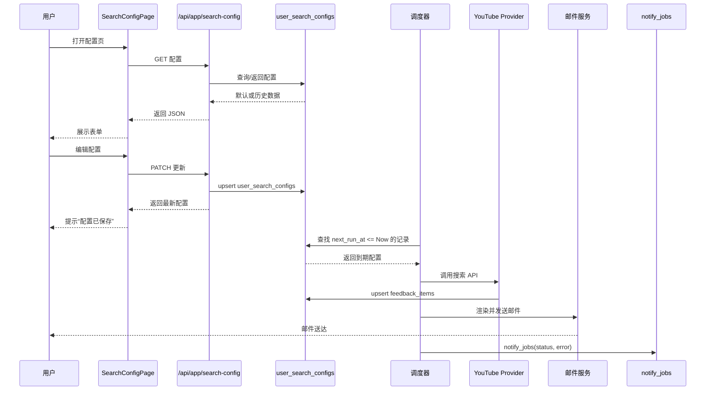
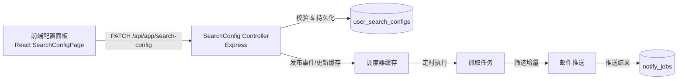
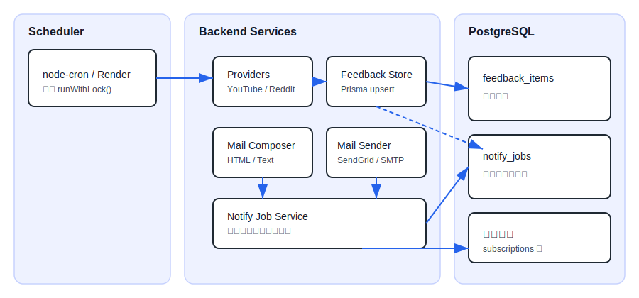
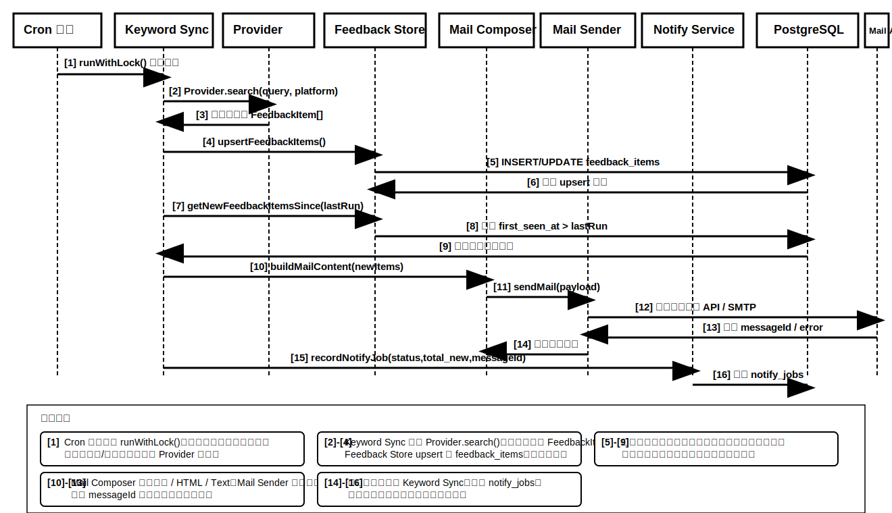
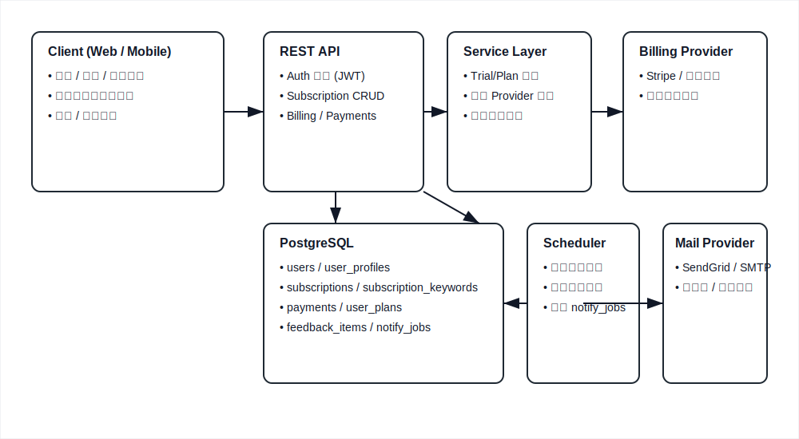
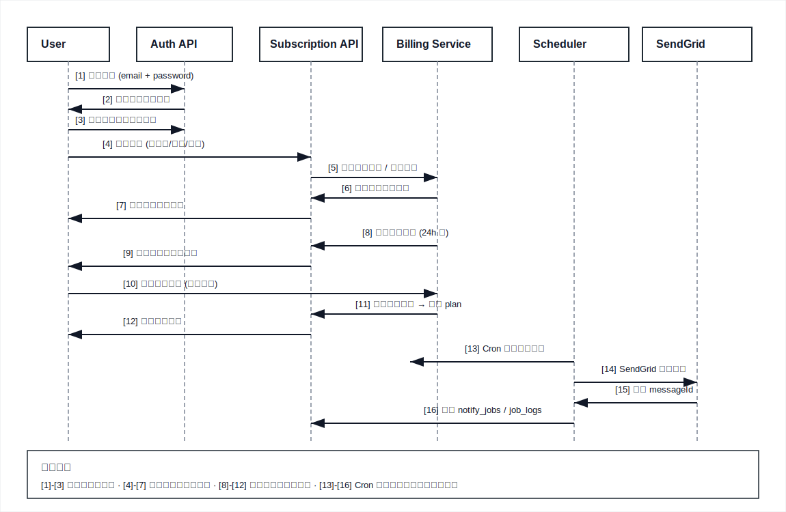
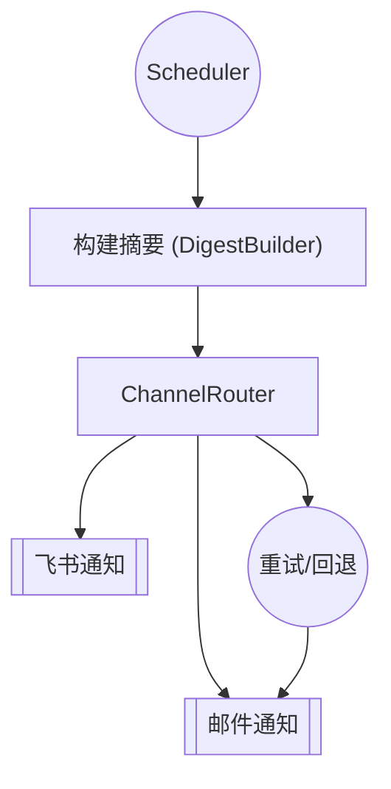
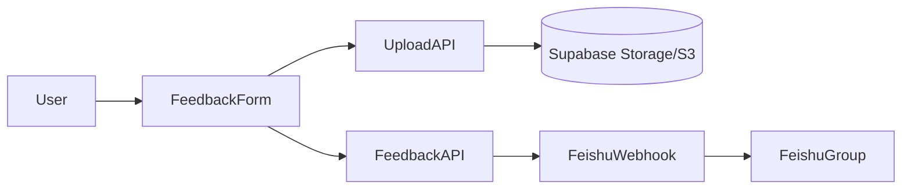

# YouTube & Reddit 反馈抓取 Demo 技术方案（更新版）

> 面向刚入门的开发者：本文详细解构“输入关键词 → 选择平台 → 获取 YouTube 视频或 Reddit 帖子 → 在前端卡片展示”的实现方式。现有 Demo 已验证 YouTube 流程，本文在此基础上扩展 Reddit 支持的设计，方便后续按图实现。

---

## 1. 整体架构

### 1.1 架构总览

整体拓扑如表所示，采用前后端分离 + 第三方平台 API 的经典架构。

| 角色/组件 | 说明 | 交互方向 |
|-----------|------|----------|
| 用户浏览器 | 访问 React 单页应用 | 通过 HTTPS 调用前端静态资源、向后端请求 API |
| 前端（React SPA） | Vite + TypeScript；负责 UI、状态管理、发起搜索/认证请求 | 调用后端 REST API、调用第三方静态资源（二维码等） |
| 后端（Express API） | Node.js + TypeScript；统一入口 `/api/*` | 处理认证、搜索、支付、告警等逻辑；调用数据库与外部服务 |
| 数据库（PostgreSQL） | 通过 Prisma 访问 | 存储用户、订阅、订单、告警等业务数据 |
| 外部服务 | YouTube Data API、Reddit API、支付网关、邮件服务、Slack | 后端通过 HTTP/HTTPS 与之通讯 |

数据流向说明：
1. 浏览器请求前端静态资源，或通过 Fetch 调用后端 API。
2. 后端根据 API 类型，从数据库读取/写入数据。
3. 搜索请求需要调用 YouTube/Reddit API 获取第三方内容。
4. 支付、告警、邮件等按需触发对应外部服务。

### 1.2 代码目录（建议组织）
```bash
product-analysis/
├─ packages/
│  ├─ web/                  # 前端 (React + Vite + TS)
│  │  ├─ src/
│  │  │  ├─ components/     # SearchBar, PlatformSwitch, ResultList, Toast 等
│  │  │  ├─ hooks/          # useFeedbackSearch, usePlatformState
│  │  │  ├─ services/       # fetcher 封装
│  │  │  ├─ stores/         # （可选）全局状态
│  │  │  └─ types/          # 公共类型定义
│  │  └─ vite.config.ts
│  └─ server/               # 后端 (Express + TS)
│     ├─ src/
│     │  ├─ routes/
│     │  │  └─ search.ts    # /api/search 路由
│     │  ├─ services/
│     │  │  ├─ youtube.ts   # YouTube provider
│     │  │  └─ reddit.ts    # Reddit provider
│     │  ├─ providers/
│     │  │  └─ index.ts     # provider registry & interface
│     │  ├─ middlewares/    # validateQuery、rate-limit、errorHandler
│     │  ├─ utils/          # env、logger、http client
│     │  └─ auth/           # redditTokenManager（缓存 access_token）
│     └─ tsconfig.json
├─ docs/                    # 需求、原型、技术方案
└─ package.json             # pnpm workspace
```

---

## 2. 端到端流程

### 2.1 搜索端到端流程

1. 用户在前端页面选择平台（YouTube/Reddit），输入关键字并点击搜索。
2. 前端通过 `GET /api/search?platform=xxx&query=xxx` 调用后端。
3. 后端校验参数、检查节流限制，基于 `platform` 从 Provider Registry 选择对应实现。
4. Provider 调用第三方平台 API（YouTube Data API 或 Reddit OAuth API），获取原始数据。
5. Provider 将外部数据映射成统一的 `FeedbackItem` 结构并返回给后端。
6. 后端拼装响应（含分页信息）返回给前端。
7. 前端根据响应更新搜索结果、历史记录及状态提示。

### 2.2 流程详解
1. **前端输入**：用户选择平台（YouTube/Reddit）、输入关键词，点击“搜索”。
2. **调用接口**：前端请求 `GET /api/search?platform=reddit&query=apple&pageToken=...`。
3. **后端校验**：
   - 检查 `platform` 是否在支持列表。
   - 校验 `query` 非空、长度 ≤ 100。
   - 可根据平台 + 关键词做节流控制（例如 30 秒内重复查询直接命中缓存）。
4. **选择 Provider**：
   - 调用 `providerRegistry.resolve(platform)` 返回对应实现。
   - 提供统一接口：`search({ query, cursor, limit }): Promise<SearchResult>`.
5. **外部 API 调用**：
   - **YouTube**：先 `search.list` 拿 videoId，再 `videos.list` 获取详情。使用 API Key。
   - **Reddit**：如缓存 token 过期，先调用 OAuth `POST https://www.reddit.com/api/v1/access_token` 刷新。随后 `GET https://oauth.reddit.com/search` 进行查询，携带 `Authorization: Bearer <token>`。
6. **响应整合**：
   - 统一字段结构：`platform`, `id`, `title`, `author`, `publishedAt`, `url`, `permalink`, `media`, `score/viewCount`, `fetchedAt`, `pageInfo`。
   - `pageInfo` 对 YouTube 填充 `nextPageToken`，对 Reddit 填充 `after`/`before`。
7. **前端渲染**：
   - 更新历史记录、展示骨架 → 列表卡片 → Toast 提示。
   - 根据 `platform` 渲染不同卡片组件（YouTubeCard / RedditCard）。

---

## 3. 技术选型（更新）

| 分类 | 方案 | 理由 | 备注 |
| --- | --- | --- | --- |
| 构建 | pnpm + Monorepo | 管理前后端依赖统一 | `packageManager` 写入 package.json |
| 前端 | React 18 + Vite + TypeScript | 快速开发 + 热更新体验好 | Hooks 实现状态逻辑 |
| UI | 手写 CSS / Tailwind | 已有 CSS 基础，可继续优化 | 组件化样式，后续可引入设计系统 |
| API 客户端（前端） | Fetch | 内置，无需额外依赖 | 如需拦截器可换 `ky`/`axios` |
| 状态管理 | React Hooks + localStorage | 需求简单，本地持久化历史关键词 | 未来可换 Zustand |
| 后端框架 | Express + TypeScript | 门槛低、社区广 | 若后续变复杂可迁移 NestJS |
| HTTP 客户端（后端） | `node-fetch` / `undici fetch` | 简洁处理 REST 请求 | 现已使用 `undici` 支持代理 |
| OAuth 管理 | 自建 `RedditTokenManager` | 脚本应用授权简单 | 可封装刷新/缓存逻辑 |
| 日志 | `console.log` (基础) | demo 阶段足够 | 后续可引入 `pino` |
| 配置 | `dotenv` | 统一管理密钥、代理 | `.env` 不入库 |

---

## 4. 模块设计详解

### 4.1 前端

#### 4.1.1 组件结构

前端组件按照“页面（Page）+ 组件（Component）”组织，核心关系如下：

- `App.tsx`
  - 包裹 `AuthProvider`，负责全局路由、Toast 容器。
  - 注册路由 `/app` → `SearchPage`。
- `SearchPage`
  - `PlatformSwitch`：平台选择按钮。
  - `SearchBar`：输入框、历史关键字、搜索按钮。
  - `ResultList`：根据平台渲染 `YouTubeCard` 或 `RedditCard`。
  - `Pagination`：上一页/下一页操作。
  - `ToastContainer`：显示复制/错误提示。
  - `LoadingSkeleton` / `EmptyState` / `ErrorBanner`：不同状态的 UI 呈现。

通过这种自顶向下的组合结构，组件职责清晰且易于拆分测试。

#### 4.1.2 Hook 设计
```ts
type Platform = 'youtube' | 'reddit';

type SearchParams = {
  platform: Platform;
  query: string;
  cursor?: string;        // YouTube: pageToken, Reddit: after
};

type SearchResult = {
  items: FeedbackItem[];
  pageInfo: {
    nextCursor?: string | null;
    prevCursor?: string | null;
    totalResults?: number;
    resultsPerPage?: number;
  };
};

export function useFeedbackSearch() {
  const [state, setState] = useState<{
    loading: boolean;
    error: string | null;
    platform: Platform;
    items: FeedbackItem[];
    pageInfo: SearchResult['pageInfo'];
    lastQuery: string;
  }>(/* ... */);

  const search = async ({ platform, query, cursor }: SearchParams) => {
    // 1. 取消上一次请求（AbortController）
    // 2. 调用 `/api/search?platform=${platform}&query=${query}&cursor=${cursor}`
    // 3. 根据响应更新 items / pageInfo / lastQuery
    // 4. 捕获错误设置 error 状态
  };

  return { ...state, search };
}
```
- Hook 内部可封装历史记录写入 (`localStorage`)、分页滚动至顶部、复制链接辅助函数等。
- 为避免快速多次搜索造成请求竞态，用 `AbortController` 终止旧请求。

### 4.2 后端

#### 4.2.1 Provider 接口
```ts
interface SearchProvider {
  search(params: {
    query: string;
    cursor?: string;
    limit?: number;
  }): Promise<SearchResult>;
}

const providerRegistry: Record<Platform, SearchProvider> = {
  youtube: new YoutubeProvider(),
  reddit: new RedditProvider(),
};
```

#### 4.2.2 YouTube Provider（已实现）
- 逻辑与当前 Demo 相同：`search.list` → `videos.list` → 组装 `FeedbackItem`。
- 建议补充 `category`、`duration` 等字段使用 `videos.list` 的 `contentDetails`。

#### 4.2.3 Reddit Provider（新增）
```ts
class RedditProvider implements SearchProvider {
  constructor(private http = fetch, private tokenManager = new RedditTokenManager()) {}

  async search({ query, cursor, limit = 10 }: Params) {
    const token = await this.tokenManager.getToken();
    const params = new URLSearchParams({
      q: query,
      sort: 'new',         // 或 'relevance'
      limit: String(limit),
      type: 'link',        // 避免评论结果
      restrict_sr: 'false'
    });
    if (cursor) params.set('after', cursor);

    const resp = await this.http(`https://oauth.reddit.com/search?${params}`, {
      headers: {
        Authorization: `Bearer ${token}`,
        'User-Agent': 'ProductInsightsDemo/0.1 by YOUR_USERNAME'
      }
    });
    await assertOk(resp); // 403/429/5xx => 抛错
    const data = await resp.json();

    return {
      items: data.data.children.map(mapRedditPost),
      pageInfo: {
        nextCursor: data.data.after ?? null,
        prevCursor: data.data.before ?? null,
        resultsPerPage: limit
      }
    };
  }
}
```
- `mapRedditPost` 需提取 `title`, `author`, `subreddit`, `created_utc`, `score`, `permalink`, `url`, `thumbnail` 等。
- 注意 `selftext_html` 可能包含 HTML，必要时做清洗或截取摘要。

#### 4.2.4 Reddit Token 管理
```ts
class RedditTokenManager {
  private token?: { value: string; expiresAt: number };

  async getToken(): Promise<string> {
    if (!this.token || Date.now() > this.token.expiresAt) {
      const creds = Buffer.from(`${clientId}:${clientSecret}`).toString('base64');
      const body = new URLSearchParams({
        grant_type: 'password',
        username: process.env.REDDIT_USERNAME!,
        password: process.env.REDDIT_PASSWORD!
      });
      const resp = await fetch('https://www.reddit.com/api/v1/access_token', {
        method: 'POST',
        headers: {
          Authorization: `Basic ${creds}`,
          'Content-Type': 'application/x-www-form-urlencoded',
          'User-Agent': 'ProductInsightsDemo/0.1 by YOUR_USERNAME'
        },
        body
      });
      await assertOk(resp);
      const data = await resp.json();
      this.token = {
        value: data.access_token,
        expiresAt: Date.now() + (data.expires_in - 60) * 1000 // 提前 60s 过期
      };
    }
    return this.token.value;
  }
}
```
- Demo 阶段可使用脚本型应用 + 主账号密码。正式环境建议使用 Web App + OAuth 授权。

#### 4.2.5 路由层
```ts
router.get('/search', validateQuery, validatePlatform, rateLimit, async (req, res, next) => {
  try {
    const { platform, query, cursor } = req.query as Record<string, string>;
    const provider = providerRegistry[platform as Platform];
    const result = await provider.search({ query, cursor, limit: 10 });
    res.json({ platform, keyword: query, ...result });
  } catch (error) {
    next(error);
  }
});
```

#### 4.2.6 速率 & 缓存策略
- **速率限制**：使用 `express-rate-limit` 以 IP 为维度（示例：60 req/min）。
- **关键词节流**：`Map<platform+query, timestamp>`，若短时间重复请求则直接返回缓存或提示稍后重试。
- **缓存（可选）**：`Map<cacheKey, SearchResult>` + TTL。key 可组合 `platform|query|cursor`。
- **代理**：已在 `index.ts` 中支持 `HTTP_PROXY` / `HTTPS_PROXY`，必要时使用 `setGlobalDispatcher(new ProxyAgent(...))`。

---

## 5. 数据模型（统一定义）

```ts
type Platform = 'youtube' | 'reddit';

type FeedbackItem = {
  platform: Platform;
  keyword: string;
  id: string;               // YouTube: videoId, Reddit: post id
  title: string;
  author: string;           // YouTube: channelTitle
  publishedAt: string;      // ISO8601
  fetchedAt: string;        // ISO8601
  url: string;              // 外部访问链接
  permalink?: string;       // Reddit 内部链接
  media?: {
    thumbnailUrl?: string;
    previewUrl?: string;
  };
  metrics?: {
    viewCount?: number;
    score?: number;
    commentCount?: number;
  };
  labels?: string[];        // 例如 subreddit、平台 tag
};

type SearchResult = {
  items: FeedbackItem[];
  pageInfo: {
    totalResults?: number;
    resultsPerPage?: number;
    nextCursor?: string | null; // YouTube: nextPageToken, Reddit: after
    prevCursor?: string | null;
  };
};
```

---

## 6. 配置与环境变量

| 变量 | 必填 | 默认 | 说明 |
| --- | --- | --- | --- |
| `PORT` | 否 | 8080 | Express 监听端口 |
| `YOUTUBE_API_KEY` | 是 | - | YouTube Data API Key |
| `REDDIT_CLIENT_ID` | 是 | - | Reddit 脚本应用 client id |
| `REDDIT_CLIENT_SECRET` | 是 | - | Reddit 脚本应用 client secret |
| `REDDIT_USERNAME` | 是 | - | Reddit 账号用户名 |
| `REDDIT_PASSWORD` | 是 | - | Reddit 账号密码（脚本应用必需） |
| `QUERY_THROTTLE_SECONDS` | 否 | 30 | 每平台 + 关键词的最小间隔 |
| `CACHE_TTL_SECONDS` | 否 | 600 | 缓存有效期（可留空禁用） |
| `HTTP_PROXY`/`HTTPS_PROXY` | 否 | - | 访问外部 API 必需时配置 |

> 建议提供 `.env.example` 并在 README 中说明如何申请各平台的 Key。

---

## 7. 错误与日志

- **外部 API 错误**：捕获状态码与 message，包装后返回给前端。例如 401 → “凭证失效，请检查 API Key”；429 → “请求过于频繁，请稍后再试”。
- **Token 失效**：Reddit 401 时自动刷新 token 再重试一次；若仍失败则记录错误并返回 500。
- **代理/网络失败**：`UND_ERR_CONNECT_TIMEOUT`、`ECONNREFUSED` 等异常需提示用户检查代理。
- **日志字段建议**：时间、平台、关键词、耗时、状态码、是否命中缓存。
- **监控扩展**：可在后续接入 Prometheus/Grafana 或 SaaS 监控服务，统计每个平台成功率与延迟。

---

## 8. 部署与运行

1. **本地开发**
   ```bash
   # 安装依赖
   pnpm install

   # 启动后端（确保 .env 配置好 Key）
   pnpm --filter server dev

   # 启动前端
   pnpm --filter web dev
   ```
   浏览器访问 `http://localhost:5173`。

2. **生产构建**
   ```bash
   pnpm --filter server build       # 输出 dist/index.js
   pnpm --filter web build          # 输出 packages/web/dist
   pnpm --filter web preview        # 本地验证静态资源
   ```

3. **部署建议**
   - 后端：Render、Railway、Fly.io 等 Node 平台，记得配置环境变量与代理。
   - 前端：Vercel/Netlify 静态托管，将 `VITE_API_BASE_URL` 指向后端域名。
   - HTTPS：前后端都需启用 HTTPS，避免 OAuth 请求被拦。

---

## 9. 测试计划（阶段 4 可执行）

| 类型 | 目标 | 工具 |
| --- | --- | --- |
| 单元测试 | Provider 行为（YouTube/Reddit）、Token Manager | Vitest + nock |
| 集成测试 | `/api/search` 正常/异常返回 | supertest + nock |
| 前端组件测试 | SearchBar、ResultList 状态切换 | React Testing Library |
| 手工验收 | 实际关键词测试、代理开关、历史记录 | 浏览器 + curl |

> Reddit API 测试建议准备 MOCK，以减少真实请求。可通过 `nock` 预载 JSON 响应。

---

## 10. 迭代计划（里程碑）

| 阶段 | 目标 | 核心交付 |
| --- | --- | --- |
| T0 | 架构调整 | 前后端改成 `/api/search` + 平台参数，前端 UI 加平台切换 |
| T0 + 1 | Reddit Provider | OAuth Token 管理 + `/search` 调用 + 数据映射 |
| T0 + 2 | 前端适配 | Reddit 卡片样式、历史记录、Toast、分页体验优化 |
| T0 + 3 | 联调 & 验证 | 实测两个平台、处理错误、完善文档（running instructions） |
| T0 + 4 | （可选）质量 | 自动化测试、缓存策略、部署演示环境 |

---

## 11. 风险与对策

| 风险 | 说明 | 对策 |
| --- | --- | --- |
| Reddit 授权失败 | 登录凭证错误、2FA 开启 | 使用脚本应用专用账号，必要时改用 OAuth 授权码模式 |
| 速率限制 | 多次请求导致 429 | 实现关键词节流 + 缓存；必要时在前端提示稍后重试 |
| 代理不可用 | 公司网络无法直连外网 | 在 `.env` 配置 `HTTP_PROXY`/`HTTPS_PROXY`，并在代码中启用 ProxyAgent |
| 跨平台字段差异 | 前端渲染需要判断 | 使用统一 `FeedbackItem` + 平台特定子组件 |

---

## 12. 账号与认证模块设计

> 本章节补充 Demo 中账号注册、登录、邮箱验证、密码找回等功能的技术实现；与搜索模块属于同一 Express 服务。

### 12.1 模块概览
- **职责**：用户生命周期管理（注册、登录、会话续期、邮箱验证、密码重置、试用与订阅状态维护）。
- **依赖**：
  - Express 路由：`/api/auth/*`
  - Prisma 模型：`users`、`user_profiles`、`refresh_tokens`
  - 工具库：`bcryptjs`（密码哈希）、`zod`（参数校验）、`jsonwebtoken`（access token）、自定义 `token` 工具（生成签名 token）、`sendMail`（邮件发送）。
- **Token 策略**：
  - `accessToken`：JWT，`AUTH_JWT_SECRET` 签名，默认 `AUTH_JWT_EXPIRES_IN=1h`。
  - `refreshToken`：48 位随机串，经 `hashToken`(SHA256) 存入 DB，默认有效期 `AUTH_REFRESH_EXPIRES_DAYS`。
- **邮件模板**：集中在 `services/auth/mail-templates.ts`，包含邮箱验证与密码重置模板。

#### 12.1.1 模块结构示意

```text
┌──────────────┐      POST /api/auth/*      ┌─────────────────────────┐
│  前端 SPA    │ ─────────────────────────▶ │  Auth Controller (Express)│
└─────┬────────┘                            └────────┬─────────────────┘
      │                                           Prisma
      │                                           │
      │                                           ▼
      │                                  ┌────────────────────┐
      │                                  │  PostgreSQL 数据库 │
      │                                  │  users/profiles    │
      │                                  │  refresh_tokens 等 │
      │                                  └────────┬──────────┘
      │                                           │
      │                                 调用 sendMail/第三方邮件服务
      ▼                                           │
┌──────────────┐                       ┌────────────────────┐
│ 浏览器存储   │◀──────────────────────│ 邮件服务 (SendGrid 等)│
└──────────────┘                       └────────────────────┘
```

**结构解析**

1. **前端 SPA（左上）**：React 单页应用负责展示注册/登录等表单，并通过 `fetch` 调用 `/api/auth/*`。所有与账号相关的交互都从这里发起。
2. **Auth Controller（右上）**：位于 Express 服务中，集中处理注册、登录、刷新、注销、邮箱验证、密码找回等 REST 接口。控制器接收到请求后会先做参数校验，再委派给业务服务。
3. **Prisma + PostgreSQL（中间）**：控制器通过 Prisma ORM 访问数据库，读写 `users`、`user_profiles`、`refresh_tokens` 以及后续扩展的订阅/支付表。所有状态（试用截止时间、邮箱是否验证、refresh token 是否撤销）都持久化在这里。
4. **邮件服务 sendMail（底部）**：当需要发送验证邮件或重置密码邮件时，Auth 控制层会调用 `sendMail` 工具，它会根据配置选择 SendGrid、SMTP 或 stub，实现真正的邮件投递。
5. **浏览器存储（左下）**：成功登录后，前端会将 access token（内存或 storage）与 refresh token（通常存于 secure storage）保存起来，以供后续 API 调用和刷新使用。

整体流程说明：

1. 用户在前端填写信息，触发 `/api/auth/*` 请求。
2. Auth Controller 校验输入、调用 Prisma 操作数据库，完成用户写入或状态更新。
3. 若流程需要邮件通知，则调用 sendMail 将邮件发送到配置的第三方服务。
4. Controller 将结果（用户信息、token 等）返回给前端；前端更新本地存储或 UI 状态。
5. 后续的邮箱验证或密码找回同样按照“前端 → Auth Controller → 数据库/邮件 → 前端”的链路循环执行。

#### 12.1.2 关键数据流

| 流程 | 输入 | 处理 | 输出 |
|------|------|------|------|
| 注册 | 邮箱、密码、姓名/时区 | 参数校验 → 写入用户/Token → 发送验证邮件 | 用户信息 + access/refresh token |
| 登录 | 邮箱、密码 | 校验凭证 → 更新 refresh token | 用户信息 + access/refresh token |
| 邮箱验证 | 验证 token | 校验 token → 更新 `email_verified_at` | 最新用户信息 |
| 密码找回 | 邮箱/重置 token | 生成 mail token / 校验 token → 更新密码 → 撤销旧 token | 密码更新，强制重新登录 |

### 12.2 数据模型
| 表 | 关键字段 | 说明 |
| --- | --- | --- |
| `users` | `email`（唯一）、`password_hash`、`status`、`trial_ends_at`、`plan_id`、`plan_expire_at`、`email_verified_at` | 用户主档，存储试用/订阅状态。 |
| `user_profiles` | `full_name`、`timezone`、`locale` | 注册时的附加信息，可为空。 |
| `refresh_tokens` | `token_hash`、`expires_at`、`revoked`、`user_id` | 刷新会话的白名单 Token。 |

### 12.3 注册流程

注册过程可拆分为以下步骤：

1. 前端收集邮箱、密码及可选的姓名/时区，并完成初步校验。
2. 向 `POST /api/auth/register` 提交表单；后端再次使用 `zod` 校验。
3. Prisma 检查邮箱唯一性，若存在返回 409 错误。
4. 使用 bcrypt 生成密码哈希，写入 `users`（`status=trialing`、`trial_ends_at=当前时间+1天`）。
5. 如有姓名/时区，则同步创建 `user_profiles` 记录。
6. 生成 refresh token（48 位随机字符串），将哈希存入 `refresh_tokens`。
7. 发送邮箱验证邮件并返回 `accessToken`/`refreshToken` 及用户信息。
8. 前端跳转 `/app`，同时提示“邮箱未验证”供用户后续操作。

```text
用户浏览器
    │ 提交注册表单 (fetch)
    ▼
Express /api/auth/register
    │ zod 校验参数
    │ Prisma 创建 users / profiles / refresh_tokens
    │ 调用 sendMail 发送验证邮件
    ▼
响应 accessToken + refreshToken + user
    │
    ▼
前端更新会话并跳转 /app
```

**实现要点**
- 使用 `zod` 校验邮箱、密码长度（8~64）、姓名/时区长度。
- `hashPassword` 使用 bcrypt（默认 10 rounds）。
- 注册后立即调用 `syncUserLifecycle` 确保状态正确。
- 邮件发送失败不会阻塞注册流程，但需提示用户手动重发。

### 12.4 登录 / 会话续期

1. 前端调用 `POST /api/auth/login`，提交邮箱和密码。
2. 后端查找用户并使用 bcrypt 校验密码；若失败返回 401。
3. 调用 `syncUserLifecycle`，根据试用/订阅到期情况更新 `status`。
4. 创建或更新 refresh token 记录，生成新的 access token。
5. 将用户信息及 token 返回给前端，前端更新会话状态。

```text
用户浏览器
    │ 提交登录 (email/password)
    ▼
Express /api/auth/login
    │ 查找用户 → bcrypt 校验密码
    │ syncUserLifecycle 同步 trial/past_due
    │ 更新/创建 refresh_tokens 记录
    ▼
返回 accessToken + refreshToken + user
    │
    ▼
前端保存 token，更新 AuthContext
```

其他接口：
- `POST /api/auth/refresh`：校验 refresh token（哈希匹配、未过期、未撤销），成功后下发新的 access token，并根据需要替换 refresh token。
- `POST /api/auth/logout`：将对应 refresh token 记录标记为 `revoked=true`，前端清理本地状态。

### 12.5 邮箱验证与重发

- 注册成功后，用户会跳转到 `/verify-email` 提示页，同时收到带 token 的验证邮件。
- 邮件中的 token 为自签 JSON（含 `userId`、`type='email_verification'`、`expiresAt`），有效期默认 24 小时。
- 用户访问验证链接 → `POST /api/auth/email/verify`，后端校验 token，有效则更新 `email_verified_at` 并再次 `syncUserLifecycle`。
- 重复访问同一链接不会抛错，接口返回最新用户信息。
- `POST /api/auth/email/resend` 用于重发验证邮件，仅当邮箱存在且未验证时执行。

```text
注册成功 → 用户访问 /verify-email 页面
      │
      ├─ 点击邮件链接 → POST /api/auth/email/verify
      │        └─ 校验 token → 更新 email_verified_at → 返回最新用户信息
      │
      └─ 点击“重新发送” → POST /api/auth/email/resend
               └─ 若邮箱存在且未验证 → 发送新的验证邮件
```

### 12.6 密码找回

1. 用户在 `/password/forgot` 提交邮箱，调用 `POST /api/auth/password/reset/request`。
   - 无论邮箱是否存在都返回 204，以防止撞库。
   - 若邮箱存在则发送带 `password_reset` token 的邮件（有效期 24 小时）。
2. 用户通过邮件链接访问 `/password/reset?token=...`，输入新密码并提交 `POST /api/auth/password/reset/confirm`。
3. 后端校验 token，有效则更新密码哈希并撤销该用户所有 refresh token，强制重新登录。

```text
用户 → /password/forgot → POST /api/auth/password/reset/request
    │ (始终返回 204，若存在邮箱则发送 reset token 邮件)
邮件链接 → /password/reset?token=...
    │ 提交新密码 → POST /api/auth/password/reset/confirm
    └─ 校验 token → 更新 password_hash → revoke refresh tokens → 返回 204
```

### 12.7 状态同步逻辑
- `syncUserLifecycle(user)` 在以下场景触发：
  - 登录成功。
  - 刷新 token。
  - 邮箱验证成功。
  - 订阅支付成功后（调用 `createSubscription` 内部更新）。
- 判断规则：
  - `status=trialing` 且 `trial_ends_at <= now` → 更新为 `past_due`。
  - `status=active` 且 `plan_expire_at <= now` → 更新为 `past_due`。
  - 订阅或续费成功将 `status` 重置为 `active` 并更新 `plan_expire_at`。

### 12.8 安全与改进
- **现有措施**：
  - 密码哈希存储。
  - Refresh token 使用哈希 + 过期时间 + 撤销标记。
  - 邮箱未验证禁止订阅/支付。
  - 关键接口使用 `zod` 校验，避免不合法输入。
- **待改进项**（可按优先级迭代）：
  - 密码复杂度校验（至少包含数字/字母/特殊字符）。
  - 登录失败次数限制、防爆破（结合 `express-rate-limit` 或 reCAPTCHA）。
  - 邮件链接单次使用或短期有效策略。
  - accessToken 改为 `httpOnly` Cookie，防止 XSS。
  - 审计日志：记录登录、失败重试、重置密码等事件。

### 12.9 接口列表
| 方法 | 路径 | 描述 |
| --- | --- | --- |
| POST | `/api/auth/register` | 注册新用户 |
| POST | `/api/auth/login` | 登录，返回 user + tokens |
| POST | `/api/auth/email/resend` | 重发验证邮件 |
| POST | `/api/auth/email/verify` | 校验邮箱验证 token |
| POST | `/api/auth/password/reset/request` | 请求密码重置邮件 |
| POST | `/api/auth/password/reset/confirm` | 确认密码重置 |
| POST | `/api/auth/refresh` | 刷新 access/refresh token |
| POST | `/api/auth/logout` | 注销（撤销 refresh token） |

所有接口返回 JSON，错误统一由 `handleError` 包装为 `{ message, status }`。
| 历史记录过多 | localStorage 容量浪费 | 仅保留最近 5 条，提供清空按钮 |

---

通过以上设计，可以在现有 Demo 的基础上平滑扩展 Reddit 抓取能力，保持代码结构清晰、易扩展，并为后续新增平台、增加智能分析（情感、主题等）打下基础。*** End Patch*** End Patch to=functions.apply_patch to=functions.apply_patch to=functions.apply_patch to=functions.apply_patch to=functions.apply_patch to=functions.apply_patch to=functions.apply_patch to=functions.apply_patch to=functions.apply_patch to=functions.apply_patch to=functions.apply_patch

## 12. 部署方案（Render 免费层 + Vercel 免费层）

> 目标：在不花费额外费用的情况下，将 Demo 以“后端 Render + 前端 Vercel”上线，便于公开演示并保持基础可维护性。流程适合新手开发者照做。

### 12.1 部署架构
```
┌────────────┐      ┌────────────────────────┐        ┌─────────────────────────────┐
│ 最终用户浏览器 │◄────►│ Vercel 静态站点 (HTTPS/CDN) │◄────►│ Render Node Service (HTTPS) │
└────────────┘      └────────────────────────┘        └─────────────────────────────┘
                           ▲                                  ▲
                           │                                  │
                           ▼                                  ▼
                       GitHub Repo                    YouTube/Reddit API (通过代理)
```
- 前端只负责请求后端 API，不直接访问第三方，终端用户无需 VPN。
- 后端负责 OAuth、速率限制、数据统一，Render 免费层可满足 Demo 需求。
- GitHub 保持代码版本，便于后续自动化测试或部署。

### 12.2 环境变量准备
**后端（Render）**
```
YOUTUBE_API_KEY=...
REDDIT_CLIENT_ID=...
REDDIT_CLIENT_SECRET=...
REDDIT_USERNAME=...
REDDIT_PASSWORD=...
REDDIT_USER_AGENT=ProductInsightDemo/0.1 (by /u/<reddit-username>)
HTTP_PROXY=...      # 若云环境需代理访问外网
HTTPS_PROXY=...
QUERY_THROTTLE_SECONDS=30
CACHE_TTL_SECONDS=600
PORT=8080           # Render 自动注入
```

**前端（Vercel）**
```
VITE_API_BASE_URL=https://<render-service-name>.onrender.com
```

> 所有密钥应存放在 Render/Vercel 的环境变量配置中，不写入仓库。GitHub Actions 也可以统一管理 Secrets。

### 12.3 后端部署步骤（Render 免费层）
1. 将最新代码推送到 GitHub `main` 分支，确保 `pnpm test` 全部通过。
2. 登录 https://dashboard.render.com → “New +” → “Web Service”。
3. 选择 GitHub 仓库 → Branch 选 `main`。
4. 设置参数：
   - Environment：Node 18+。
   - Build Command：`pnpm install --frozen-lockfile && pnpm --filter server build`
   - Start Command：`node packages/server/dist/index.js`
5. 在 “Environment Variables” 中填入第 12.2 节的后端变量（包括代理配置）。
6. 点击 “Create Web Service”，Render 会自动构建并部署。
7. 部署完成后，在本地运行：
   ```bash
   curl "https://<service-name>.onrender.com/api/search?platform=youtube&query=Apple"
   curl "https://<service-name>.onrender.com/api/search?platform=reddit&query=Apple"
   ```
   验证接口是否正常返回 JSON。

若 Render 网络受限访问不到 Reddit/YouTube，可：
- 换 Render 区域（如 US/EU）。
- 在 Render Shell 配置 Cloudflare WARP 或其他代理，再将地址写入 `HTTP_PROXY`/`HTTPS_PROXY`。

### 12.4 前端部署步骤（Vercel 免费层）
1. 登录 https://vercel.com → “New Project”，选择同一 GitHub 仓库。
2. 构建配置：
   - Root Directory：`packages/web`
   - Install Command：`pnpm install --frozen-lockfile`
   - Build Command：`pnpm --filter web build`
   - Output Directory：`packages/web/dist`
3. 添加环境变量 `VITE_API_BASE_URL` 指向前一步的 Render HTTPS 地址。
4. 点击 “Deploy”。部署完成后访问 `https://<project>.vercel.app`，输入关键词测试搜索。
5. 如需绑定自定义域名（如 `demo.yourcompany.com`），在 Vercel Domain 面板中添加域名，并在 DNS 服务商处配置 CNAME 指向 Vercel。

### 12.5（可选）配置 CI/CD 流程
若希望自动测试/部署，可在仓库添加 GitHub Actions 流程（示例）：

```yaml
name: CI
on:
  push:
    branches: [main]
  pull_request:

jobs:
  test-and-deploy:
    runs-on: ubuntu-latest
    steps:
      - uses: actions/checkout@v4
      - uses: pnpm/action-setup@v3
        with:
          version: 10
      - uses: actions/setup-node@v4
        with:
          node-version: 20
          cache: 'pnpm'
      - run: pnpm install --frozen-lockfile
      - run: pnpm test
      - name: Deploy Backend
        if: github.ref == 'refs/heads/main'
        uses: johnbeynon/render-deploy-action@v1
        with:
          service-id: ${{ secrets.RENDER_SERVICE_ID }}
          api-key: ${{ secrets.RENDER_API_KEY }}
      - name: Deploy Frontend
        if: github.ref == 'refs/heads/main'
        run: |
          pnpm --filter web build
          npx vercel deploy --prod --token ${{ secrets.VERCEL_TOKEN }} --yes
```

部署时需在 GitHub Secrets 中配置：`RENDER_SERVICE_ID`、`RENDER_API_KEY`、`VERCEL_TOKEN` 等凭证。

### 12.6 部署后回归与监控
- **回归测试**：
  1. 在 Vercel 域名上测试 YouTube/Reddit 搜索，确认平台切换、分页、复制链接、历史记录等行为正常。
  2. 模拟错误（如断开代理、使用无结果关键词）检查错误提示。
- **日志监控**：Render/Vercel 提供实时日志，可在部署后留意 401/403/429 等异常日志。
- **配额控制**：关注 Reddit/YouTube API 调用是否触达配额；必要时在后端开启缓存或增大节流时间。

### 12.7 风险与后续扩展
- **代理稳定性**：若依赖代理访问外网，建议准备备用节点或提供断路器机制，避免代理失效导致服务不可用。
- **密钥安全**：确保所有密钥保存在 Secret 管理平台，定期轮换，避免泄漏。
- **日志与告警**：根据需要接入 Sentry、Datadog 等第三方监控工具，及时报错告警。
- **扩展性**：未来若接入 Amazon、Twitter 等平台，可复用 Provider 架构，只需在 Render 环境中新增相关凭证和 Provider 实现。

## 13. 自动抓取与邮件推送技术方案

> 新增一条“后台自动监控 + 增量邮件推送”能力：系统定期抓取关键词，识别新增内容写入数据库，并按计划发送邮件给订阅用户。

### 13.1 功能概述与架构
- **目标**：根据用户自助配置的关键词、平台、执行时间与邮箱，自动抓取 YouTube（以及可用时的 Reddit）增量内容，并以邮件形式推送，同时记录任务状态和错误。
- **现阶段限制**：若环境未配置 Reddit 凭证，则任务仅执行 YouTube；后续补充 Reddit 时可无缝启用。
- **主要模块**：
  - **配置管理**：`user_search_configs` 表存储用户偏好，由 `/api/app/search-config` 提供 CRUD。
  - **调度器 (Scheduler)**：`node-cron` 启动两个定时任务：基础关键字抓取 (`cronConfig`) 与用户自定义抓取 (`userSearchCronConfig`)。
  - **执行器 (Worker)**：`runKeywordSync` 调用 Provider 抓取数据；`runUserSearchConfigJobs` 根据用户配置执行抓取、增量计算、邮件发送。
  - **数据层**：`feedback_items` 保存抓取结果，`notify_jobs` 记录每次任务的执行状态、错误信息与上下文。
  - **通知层**：`buildMailContent` 生成邮件内容；`sendMail` 调用 SendGrid/SMTP；`notifyAlert` 通过 Slack/Webhook 提醒异常。

### 13.2 时序流程（用户自定义任务）


### 13.3 数据模型说明（与调整）
- **user_search_configs**（Prisma 已实现）：
  - `platforms text[]`：保存用户勾选的平台；后台会过滤掉未启用的平台并自动回退到默认（仅 YouTube）。
  - `slots text[]`：`HH:mm` 字符串数组；最大 3 个，入库前排序去重。
  - `notify_email`、`timezone`、`next_run_at`、`last_notified_at` 等字段用于调度。
- **notify_jobs**：新增 `user_id`、`context JSONB`，记录每次任务的详细情况（平台、关键词、下次执行时间等）。
- **feedback_items**：沿用实时搜索数据表，用于增量比较。

### 13.4 调度器设计与配置
- **基础任务 (`cronConfig`)**：上线阶段默认关闭（`.env` 中 `CRON_ENABLED=false`），日常仅依赖用户自定义任务。若运营需要额外的全局监控，可手动开启并维护 `.env` 中的关键词、平台、收件人；平台列表仍会自动过滤未启用的 Provider。
- **用户任务 (`userSearchCronConfig`)**：
  - `.env` 中的 `USER_SEARCH_CRON_*` 控制“调度器唤醒频率”（建议默认 `*/1 * * * *`，即每分钟检查一次）。真正的执行时间由 `user_search_configs.slots` 和 `timezone` 决定，用户在前端调整后可即时生效。
  - 缺省启用，可通过 `USER_SEARCH_CRON_ENABLED=false` 暂停。
  - 启动时可设置 `USER_SEARCH_CRON_RUN_ON_STARTUP=true` 强制执行一次。
- **执行入口**：`initScheduledJobs()` 内按配置启动基础任务、订阅提醒任务和用户任务；每个任务都有独立的运行锁，避免并发执行。

### 13.5 Provider 调用策略
- **平台启用检测**：`config/platforms.ts` 中提供 `isRedditConfigured()/getEnabledProviderPlatforms()`；`providers/index.ts` 根据结果动态注册 Provider，缺失时抛出“暂不支持的平台”错误。
- **用户配置过滤**：`services/search-config.ts` 在读取/写入时使用 `filterEnabledProviderPlatforms`，保证数据层不会保存未启用的平台，避免后续任务触发无效调用。
- **缓存与速率控制（待扩展）**：目前直接调用 Provider，下阶段可在 `runKeywordSync` 外层添加限流器与缓存，防止高并发触发外部限制。

### 13.6 邮件与通知
- `buildMailContent` 允许传入自定义 `subjectTemplate` 与上下文（平台、关键词、收件人等），默认模板加入“增量条数”“任务区间”等信息。
- `sendMail` 支持 SendGrid/SMTP/stub；若 `MAIL_PROVIDER=stub` 则仅打印日志，方便调试。
- 异常情况下调用 `notifyAlert` 发送 Slack 告警；若 Slack 未配置则记录错误日志。

### 13.7 错误处理与回退
- **缺少平台/关键词/时间**：在 `runUserSearchConfigJobs` 中检测，跳过执行并记录 `notify_jobs(status=partial)`。
- **外部 API 失败**：`runKeywordSync` 捕获异常并记录日志；`runUserSearchConfigJobs` 会在 `notify_jobs` 中记录 `error_message`，并触发 Slack 告警。
- **邮件失败**：`sendMail` 抛错时同样记录 `notify_jobs` 与告警。后续可加入重试策略（目前只尝试一次）。
- **配置被禁用的 Reddit**：读取配置时自动剔除 reddit，返回默认平台为 YouTube，避免任务调用失败。

### 13.8 搜索配置控制台技术方案

> 目标：为每个登录用户提供“自助配置自动抓取”能力，配置项包括平台勾选（即时生效）、关键词列表（≤3）、每日最多 3 个执行时间以及单一通知邮箱，并确保配置与调度器/邮件推送联动。

#### 13.8.1 模块关系与数据流



1. 用户在前端操作复选框/表单即触发 `PATCH` 请求，Controller 使用 `zod` 统一校验限制。
2. Controller 更新 `user_search_configs` 表（或 `user_subscriptions` 扩展字段），并返回最新配置；同时刷新内存缓存/事件队列让调度器获取最新策略。
3. 调度器周期性从缓存或数据库拉取配置，依次对每个用户按设定时间、关键词、平台触发抓取任务。
4. 抓取任务沿用 13.1~13.7 的逻辑，增量结果写入数据库、汇总邮件并记录 `notify_jobs`。

#### 13.8.2 数据建模

新增表（或在现有 `user_subscriptions` 基础上增加 JSON 字段）：

| 表 / 字段 | 类型 | 说明 |
| --- | --- | --- |
| `user_search_configs` | | 每个用户 1 条配置（`user_id` 唯一）。 |
| `user_id` | `UUID` | 与 `users.id` 外键，`onDelete: Cascade`。 |
| `platforms` | `text[]` | 默认 `{'youtube','reddit'}`，允许值包括 `youtube`、`reddit`、`x`、`facebook`；不得为空。 |
| `keywords` | `text[]` | 长度 0~3，保存去重后的关键词（小写存储以便比较）。 |
| `slots` | `time without time zone[]` | 每日执行时间 1~3 个，按升序存储；后端入库前排序去重。 |
| `notify_email` | `text` | 默认注册邮箱，可编辑；全表唯一性不强制，但需校验格式。 |
| `timezone` | `text` | 允许用户自定义，默认 `Asia/Shanghai`；调度器按用户时区计算下一次执行时间。 |
| `next_run_at` | `timestamptz` | 后台计算的下一触发时间，便于观察与调试。 |
| `updated_at` | `timestamptz` | Prisma `@updatedAt`。 |

Prisma 迁移示例：

```prisma
model UserSearchConfig {
  user_id     String   @id @db.Uuid
  platforms   String[] @default(["youtube", "reddit"])
  keywords    String[] @default([])
  slots       String[] @default([]) // HH:mm 存储，读取时转换
  notify_email String
  timezone    String   @default("Asia/Shanghai")
  next_run_at DateTime? @db.Timestamptz(6)
  updated_at  DateTime  @updatedAt @db.Timestamptz(6)

  user User @relation(fields: [user_id], references: [id], onDelete: Cascade)
}
```

> 说明：若沿用 `user_subscriptions` 表，也需增加 `platforms`、`keywords`、`notify_email`、`slots` 字段，并保证每个用户只有一条“搜索配置”订阅。

#### 13.8.3 接口设计

| 方法 | 路径 | 描述 |
| --- | --- | --- |
| GET | `/api/app/search-config` | 返回当前登录用户的配置；若不存在则返回默认值。 |
| PATCH | `/api/app/search-config` | 接收部分或全部字段，校验后保存并返回最新配置。 |

请求体（PATCH）：

```json
{
  "platforms": ["youtube", "reddit", "x"],
  "keywords": ["Apple Vision Pro", "Meta Quest 3"],
  "slots": ["08:30", "13:00"],
  "notifyEmail": "user@example.com",
  "timezone": "Asia/Shanghai"
}
```

响应统一为：

```json
{
  "platforms": ["youtube", "reddit"],
  "keywords": ["Apple Vision Pro", "Meta Quest 3", "AR 头显体验"],
  "slots": ["08:30", "13:00", "20:00"],
  "notifyEmail": "user@example.com",
  "timezone": "Asia/Shanghai",
  "nextRunAt": "2025-11-01T13:00:00+08:00",
  "updatedAt": "2025-11-01T09:05:12+08:00"
}
```

后端验证要点：
- `platforms`：枚举校验 + 去重；若为空则返回 400，并携带上次有效值以便前端回滚。
- `keywords`：trim → 大小写归一 → 去重 → 限制数量 ≤3；长度 2-60，使用 `zod.min(2).max(60)`。
- `slots`：验证格式 `HH:mm` 且数量 1~3；转换为排序数组，内部存储时可使用字符串或 `time` 类型。
- `notifyEmail`：`z.string().email()`；若与注册邮箱不同，也允许。
- 所有字段缺省时延用历史值；PATCH 语义为增量更新。

#### 13.8.4 前端交互设计

- 页面：`/app/search-config`（React Route 受保护，需要登录）。
- 状态管理：使用 `React Query`/`SWR` 拉取 + 缓存配置；修改时执行 `mutation` 并乐观更新 UI。
- 即时生效：复选框、关键词操作、时间 picker、邮箱输入变更后调用 `PATCH`，成功后提示“已保存”，失败则回滚并弹出错误 Toast。
- 关键词添加按钮逻辑：
  - 当 `keywords.length >= 3` 时禁用按钮，并保留“最多 3 个关键词”文案。
  - 删除关键词后按钮恢复；删除操作同样发 PATCH。
- 平台选择：
  - 点击勾选/取消即发送 PATCH；若后端返回 400（全取消），前端回滚并在 UI 展示“至少选择一个平台”提示。
- 时间设置：
  - 使用时间选择器列表，选中后追加；已满 3 个时禁用“添加时间”按钮。
  - 删除时间后自动 PATCH 更新。
- 邮箱输入：
  - 默认值为 `session.user.email`；输入框失焦或按 Enter 时提交 PATCH。
  - 可选添加“发送测试邮件”按钮触发 `POST /api/app/search-config/test-email`（后续实现）。
- 无数据空态：首次进入时展示操作指南与默认配置（YouTube+Reddit、无关键词、无时间时禁用保存并提示先添加）。

#### 13.8.5 调度器联动

- 调度器在每轮执行前加载所有激活配置：
  ```ts
  const configs = await prisma.userSearchConfig.findMany({
    where: { slots: { isEmpty: false } }
  });
  ```
- 对每条配置，根据 `timezone` + `slots` 计算是否当前时刻需要执行：
  ```ts
  shouldRun(config, nowUtc) =>
    config.slots.some(slot => withinMinute(slot, config.timezone, nowUtc));
  ```
- 若用户未配置关键词或 slots 为空，跳过执行并记录 debug 日志。
- 执行后更新 `next_run_at`：计算下一个 `slot`，写回数据库，便于后台展示。

#### 13.8.6 校验与错误处理

- **并发修改**：使用 Prisma `update`，携带 `user_id` 主键，避免脏写；如需更严格可增加 `version` 字段。
- **速率限制**：由于操作即时生效，建议对 PATCH 接口添加 `rate limit`（如 30 requests/min），防止频繁触发。
- **调度失败**：如果控制台配置异常（如 notify_email 为空），调度器跳过并写入告警，可复用现有 Slack 通知链路。
- **回滚策略**：前端捕获 4xx/5xx 后提示“保存失败已恢复至上一次配置”；本地保留 `lastKnownConfig` 以便快速恢复界面。

#### 13.8.7 后续扩展

- 支持多邮箱：表结构可改为 `notify_emails text[]`，并在 UI 允许新增/删除（配额控制）。
- 分用户自定义频率：新增 `frequency` 字段（`instant/daily/weekly`），与 slots 联动。
- 配额校验：结合套餐限制（来自 `Plan.limits`），根据用户状态动态控制关键词/平台数量。
- 审计记录：在 `search_config_events` 表记录每次变更（时间、字段、旧值、新值、来源 IP），便于问题排查。
- Webhook 通知：配置变更后触发内部事件，提醒运营或同步到第三方系统。

---

## 14. 邮件推送模块技术方案

> 目标：在阶段 10（邮件推送 MVP）中，将“抓取 → 增量识别”的结果转化为可阅读的日报/周报邮件，并确保发送过程可监控、可追踪。

### 14.1 架构视图



- **Scheduler（node-cron / Render Scheduler）**：周期性执行 `runWithLock()`，是抓取 + 邮件流程的入口；读取 `.env` 中的 `CRON_*`，依靠互斥锁避免重入，并负责兜住顶层异常输出日志。
- **Providers（YouTube / Reddit）**：按关键词调用外部 API，返回统一的 `FeedbackItem` 结构；支持热插拔扩展其它平台，保证后续流程无需感知差异。
- **Feedback Store（Prisma）**：将 Provider 结果 upsert 到 `feedback_items`，并提供增量查询；依赖 `(platform, external_id)` 联合唯一键去重，`first_seen_at` 作为增量过滤依据。
- **Mail Composer**：基于新增记录生成邮件主题、HTML 与纯文本版本；支持按平台/关键词分组，展示统计摘要、空数据提示，模板形式可选 Handlebars/EJS 或直接字符串拼装。
- **Mail Sender**：对外暴露统一的 `sendMail(payload)`，内部可切换 SendGrid/Mailgun/SMTP；会校验配置、支持多收件人/抄送，并返回 `messageId`，失败时抛出可读错误。
- **Notify Job Service**：记录任务状态、增量条数、邮件发送结果；读写 `notify_jobs`，必要时可扩展字段或附表以支撑重试、告警。
- **PostgreSQL**：持久化抓取记录与任务历史；当前使用 `feedback_items`、`notify_jobs`，未来可扩展 `subscriptions` 等表以支持多订阅场景。

- **Scheduler**：现有 `node-cron` 调度器触发抓取任务。
- **Providers**：负责调用外部 API 获取原始数据。
- **Feedback Store**：统一 upsert、增量查询。
- **Mail Composer**：根据新增记录生成邮件主题/正文（支持 HTML + 纯文本）。
- **Mail Service**：封装具体服务商（SendGrid/Mailgun/AWS/Nodemailer），统一 `sendMail(payload)` 接口。
- **Notify Jobs**：记录任务状态、发送结果、错误信息。
- **PostgreSQL**：保存抓取结果与任务历史，支持后续审计与报表。

### 14.2 端到端流程



1. **Cron 调度（步骤 [1]）**：`node-cron` / Render Scheduler 调用 `runWithLock()`，决定是否执行本轮抓取。
2. **Provider 抓取（步骤 [2]-[3]）**：`Keyword Sync` 逐个关键词 + 平台调用 Provider，获取标准化的 `FeedbackItem[]`。
3. **落库与去重（步骤 [4]-[6]）**：`Feedback Store` upsert 数据到 `feedback_items`，依靠联合唯一键消除重复并确认写入。
4. **增量过滤（步骤 [7]-[9]）**：同一服务按最近一次成功时间读取数据库，得到“本轮新增”列表。
5. **邮件组装（步骤 [10]）**：`Mail Composer` 基于增量记录生成主题、HTML、纯文本，包含平台统计与空数据提示。
6. **发送（步骤 [11]-[14]）**：`Mail Sender` 统一调用 `sendMail`，向外部邮件 API / SMTP 发起请求，并回传 messageId 或错误。
7. **记录任务（步骤 [15]-[16]）**：`Notify Job Service` 将状态、总新增、messageId 写入 `notify_jobs`，形成可追踪历史。

### 14.3 模块设计

| 模块 | 主要职责 | 技术要点 |
| --- | --- | --- |
| `MailConfig` | 解析 `.env` 中的邮件配置（服务商、凭证、收件人、主题模板、是否在无增量时发送等） | 与 Cron 配置类似，提供默认值与合法性校验 |
| `MailComposer` | 根据增量记录生成邮件主题、HTML 正文、纯文本 FALLBACK | 支持平台分组、关键词分组、统计摘要；HTML 模板可用 Handlebars/EJS 或直接字符串模板 |
| `MailService` | 统一 `sendMail({ subject, html, text })`，内部根据 `MAIL_PROVIDER` 调用 SendGrid/Mailgun/SMTP | 将成功响应中的 messageId 返回给调用方，失败时抛出错误并附带 HTTP 状态 |
| `NotifyJobs Service` | 写入 `notify_jobs`，记录任务状态、总新增条数、邮件发送情况 | 可在模型中新增 `mail_message_id`、`total_sent` 字段或扩展 JSON |
| `Cron Runner` | 调度抓取→过滤→邮件发送→记录状态 | 需要串联捕获异常、避免重复发送、输出日志 |

### 14.4 配置建议

在 `.env` / `.env.example` 中新增：

```
MAIL_PROVIDER=sendgrid            # sendgrid / mailgun / ses / smtp
MAIL_API_KEY=                     # 若走 API
MAIL_FROM='"Product Bot" <noreply@example.com>'
MAIL_TO=owner@example.com,pm@example.com
MAIL_SUBJECT_TEMPLATE=[Product Insight] {{date}} 新增 {{count}} 条
MAIL_SMTP_HOST=
MAIL_SMTP_PORT=465
MAIL_SMTP_USER=
MAIL_SMTP_PASS=
MAIL_SMTP_SECURE=true
MAIL_SEND_EMPTY=false             # 是否在无新增时发送“今日无更新”
```

- 对 SMTP 场景，优先使用应用专用密码；`MAIL_SMTP_SECURE` 控制 SSL/TLS。
- 多个收件人用逗号分隔；若需要暗抄送，可扩展 `MAIL_BCC`。

### 14.5 邮件内容规范

1. **主题模板**：支持变量占位，如 `{{date}}`、`{{count}}`、`{{platforms}}`。
2. **正文结构**（HTML + 纯文本）：
   - 顶部：任务时间、总新增条数、关键词/平台列表。
   - 中部：按平台分组，每个平台下按关键词列出新增条目（标题、作者、发布时间、得分/观看量、跳转链接）。
   - 底部：提示词（如“来自 Product Insight 自动推送，退订请联系...”）。
3. **空数据策略**：
   - 若 `MAIL_SEND_EMPTY=false` 且 `newItems.length === 0`，则跳过发送，仅写入 `notify_jobs`。
   - 若允许空推送，则发送简短邮件“今日无新增内容”并记录。

### 14.6 发送实现（示例）

```ts
export async function sendMail(payload: MailPayload) {
  switch (mailConfig.provider) {
    case 'sendgrid':
      return sendViaSendGrid(payload);
    case 'smtp':
      return sendViaSmtp(payload);
    default:
      throw new Error(`Unknown mail provider: ${mailConfig.provider}`);
  }
}

async function sendViaSendGrid({ subject, html, text }: MailPayload) {
  const resp = await fetch('https://api.sendgrid.com/v3/mail/send', {
    method: 'POST',
    headers: {
      Authorization: `Bearer ${mailConfig.apiKey}`,
      'Content-Type': 'application/json'
    },
    body: JSON.stringify({
      personalizations: [{ to: mailConfig.toList }],
      from: mailConfig.from,
      subject,
      content: [
        { type: 'text/plain', value: text },
        { type: 'text/html', value: html }
      ]
    })
  });
  if (!resp.ok) throw new Error(`SendGrid error ${resp.status}`);
  return { messageId: resp.headers.get('x-message-id') ?? undefined };
}
```

### 14.7 日志与容错

- **重试策略**：发送失败可立即重试 1~2 次（指数退避），仍失败则记录 `notify_jobs.status = 'failed'` 并告警。
- **幂等性**：在 `notify_jobs` 写入前，先存储 `mail_message_id`，以免重复发送。
- **监控**：输出 `console.log` → Render/本地日志，包含关键词、平台、发送状态、messageId。
- **安全**：API Key 保存在服务器环境变量，避免硬编码；对于 SMTP，建议使用应用专用密码。

### 14.8 验证步骤

1. 在 `.env` 配好邮件服务并将 `CRON_ENABLED=true`、`CRON_RUN_ON_STARTUP=true`（或手动触发一次任务）。
2. 本地运行 `pnpm --filter @app/server dev`，确认日志中出现 `[mail] sending ...`。
3. 收件人邮箱应收到模板化邮件；若 `newItems` 为空且配置允许，也会收到“今日无更新”邮件或跳过发送。
4. 在 `notify_jobs` 表中查看对应记录，确认 `status`、`total_new`、`mail_message_id`（如有）匹配。

---


## 15. 订阅管理与付费体系技术方案

> 目标：阶段 11 将单一邮箱推送演进为“多用户 + 订阅 + 付费”模式，打通注册 → 试用 → 升级 → 续费/退订全链路。以下方案给出端到端流程、模块划分、数据结构、接口契约、第三方支付对接以及运行维护要点，保证新人也能按步骤实现。

### 15.1 整体流程与时序



1. 用户通过 Web/移动客户端注册并完成邮箱验证。
2. Auth API 颁发 JWT，Subscription API 校验试用/套餐限制后写入订阅记录。
3. Billing Service 负责套餐购买、续费，接收支付渠道回调更新套餐状态。
4. Scheduler 根据订阅、试用/套餐规则触发抓取流程，生成邮件并调用 Mail Provider（SendGrid）。
5. Postgres 保存用户、订阅、支付、抓取以及发送历史，支持审计与重试。

配合序列图理解关键交互：



- [1]-[7]：注册 → 邮箱验证 → 创建订阅 → 激活试用。
- [8]-[12]：试用临界提醒与升级购买 → 支付成功后的套餐激活。
- [13]-[16]：Scheduler 读取活跃订阅 → 抓取 → 发送 → 记录 `notify_jobs`。

### 15.2 模块拆分

| 模块 | 输入 / 输出 | 核心职责 | 关键实现 |
| --- | --- | --- | --- |
| Client（Web/Mobile） | 输入：用户操作；输出：REST/GraphQL 请求 | 注册、登录、邮箱验证、订阅管理、套餐购买、退订 | React + React Query；JWT 存储在 HttpOnly Cookie；国际化/时区设置 |
| Auth Service (`/src/services/auth`) | 输入：注册/登录表单、验证 token；输出：JWT、邮箱验证邮件 | 账号体系、密码加密、验证码、Refresh Token | BCrypt、JWT、SendGrid Single Sender；支持 Google OAuth（扩展） |
| Subscription Service | 输入：用户 JWT + 订阅表单；输出：订阅 ID、配额信息 | 订阅 CRUD、关键词校验、套餐配额检查、退订 | Prisma Transaction；关键词正则规范化；限制订阅上限 |
| Billing Service | 输入：套餐 ID、支付渠道回调；输出：支付链接/状态 | 统一封装 Stripe/微信/支付宝，写入 `payments`、`user_plans` | 独立模块；Stripe SDK / 国内支付 SDK；签名校验、重放保护 |
| Plan & Trial Engine | 输入：用户状态、套餐配置；输出：是否允许操作、剩余配额 | 试用倒计时、套餐资源限制（关键词、订阅数、发送频率） | 缓存计划信息；响应 Subscription API 和 Scheduler |
| Scheduler (`cron/subscription-runner`) | 输入：当前时间、用户时区、活跃订阅 | 调度增量抓取、邮件生成、写入 `notify_jobs` | `node-cron` + Prisma 分页；Redis/DB 锁；幂等键防重复 |
| Notification Pipeline | 输入：增量数据、用户偏好；输出：邮件/推送结果 | 渲染卡片模板、调用 SendGrid、处理退订 Webhook | 复用已有 MailComposer；加入用户级 merge、退订链接 |
| Admin Console（可选） | 输入：管理员操作；输出：订阅/支付报表 | 运营维护、查看异常、手动续费/退款 | Next.js Admin App 或 Supabase Studio + SQL |

### 15.3 数据模型细化

#### 15.3.1 用户与套餐

```sql
CREATE TABLE users (
  id UUID PRIMARY KEY DEFAULT gen_random_uuid(),
  email TEXT UNIQUE NOT NULL,
  password_hash TEXT NOT NULL,
  email_verified_at TIMESTAMPTZ,
  status TEXT DEFAULT 'trialing',          -- trialing | active | past_due | canceled
  trial_started_at TIMESTAMPTZ,
  trial_ends_at TIMESTAMPTZ,
  plan_id TEXT,                            -- 当前套餐 ID（NULL 表示仅试用）
  plan_expire_at TIMESTAMPTZ,
  created_at TIMESTAMPTZ DEFAULT now(),
  updated_at TIMESTAMPTZ DEFAULT now()
);

CREATE TABLE user_profiles (
  user_id UUID PRIMARY KEY REFERENCES users(id) ON DELETE CASCADE,
  full_name TEXT,
  locale TEXT DEFAULT 'zh-CN',
  timezone TEXT DEFAULT 'Asia/Shanghai'
);

CREATE TABLE plans (
  id TEXT PRIMARY KEY,
  name TEXT NOT NULL,
  description TEXT,
  price_cents INTEGER NOT NULL,
  currency TEXT DEFAULT 'CNY',
  duration_days INTEGER NOT NULL,
  keyword_limit INTEGER,
  subscription_limit INTEGER,
  mail_per_day INTEGER,
  features JSONB
);

CREATE TABLE user_plans (
  id UUID PRIMARY KEY DEFAULT gen_random_uuid(),
  user_id UUID REFERENCES users(id),
  plan_id TEXT REFERENCES plans(id),
  started_at TIMESTAMPTZ,
  expire_at TIMESTAMPTZ,
  status TEXT DEFAULT 'active',            -- active | canceled | expired
  auto_renew BOOLEAN DEFAULT true
);

CREATE TABLE payments (
  id UUID PRIMARY KEY DEFAULT gen_random_uuid(),
  user_id UUID REFERENCES users(id),
  plan_id TEXT,
  amount_cents INTEGER,
  currency TEXT,
  provider TEXT,                           -- stripe | wechat | alipay
  provider_order_id TEXT,
  status TEXT,                             -- pending | succeeded | failed | refunded
  payload JSONB,
  paid_at TIMESTAMPTZ,
  created_at TIMESTAMPTZ DEFAULT now()
);
```

#### 15.3.2 订阅与关键词

```sql
ALTER TABLE subscriptions
  ADD COLUMN user_id UUID REFERENCES users(id) ON DELETE CASCADE,
  ADD COLUMN platforms TEXT[] DEFAULT ARRAY['youtube','reddit'],
  ADD COLUMN frequency TEXT DEFAULT 'daily',
  ADD COLUMN send_to TEXT[] DEFAULT ARRAY[]::TEXT[],
  ADD COLUMN is_active BOOLEAN DEFAULT true,
  ADD COLUMN last_run_at TIMESTAMPTZ,
  ADD COLUMN next_run_at TIMESTAMPTZ;

CREATE TABLE subscription_keywords (
  id UUID PRIMARY KEY DEFAULT gen_random_uuid(),
  subscription_id UUID REFERENCES subscriptions(id) ON DELETE CASCADE,
  keyword TEXT NOT NULL
);

CREATE TABLE subscription_runs (
  id UUID PRIMARY KEY DEFAULT gen_random_uuid(),
  subscription_id UUID REFERENCES subscriptions(id) ON DELETE CASCADE,
  run_at TIMESTAMPTZ,
  status TEXT,
  total_new INTEGER,
  total_sent INTEGER,
  mail_message_id TEXT,
  error_message TEXT
);

ALTER TABLE notify_jobs
  ADD COLUMN user_id UUID REFERENCES users(id),
  ADD COLUMN subscription_id UUID REFERENCES subscriptions(id);
```

#### 15.3.3 状态转换

| 用户状态 | 条件 | 允许操作 | Scheduler 行为 |
| --- | --- | --- | --- |
| `trialing` | `trial_ends_at >= now()` | 创建订阅（受试用上限限制） | 正常发送 |
| `trial_expiring` | `trial_ends_at - now() <= 24h` | 同上 | 附加到期提醒任务 |
| `past_due` | 套餐过期 & 无试用 | 停止创建；已有订阅停用 | Cron 跳过订阅 |
| `active` | 套餐有效 | 全功能（按套餐配额） | 正常发送 |
| `canceled` | 用户退订所有套餐 | 禁止重启（需重新购买） | Cron 跳过 |

### 15.4 API 设计

#### 15.4.1 认证模块

| Endpoint | Method | 描述 | 请求示例 | 响应 |
| --- | --- | --- | --- | --- |
| `/api/auth/register` | POST | 注册并触发验证邮件 | `{ "email": "user@demo.com", "password": "P@ssw0rd" }` | `201 Created`，返回 `userId`、`trialEndsAt`、Access Token & Refresh Token |
| `/api/auth/login` | POST | 登录换取 JWT | `{ "email": "user@demo.com", "password": "P@ssw0rd" }` | 返回 accessToken、refreshToken、用户状态 |
| `/api/auth/refresh` | POST | 刷新 access token | `{ "refreshToken": "..." }` | 新的 accessToken |
| `/api/auth/email/verify` | POST | 邮箱验证回调 | `{ "token": "signed-token" }` | 标记 `email_verified_at`，更新用户状态 |
| `/api/auth/password/reset` | POST | 发起/完成重置密码 | 发送邮件或提交新密码 | 200 |

#### 15.4.2 订阅模块

| Endpoint | Method | 权限 | 说明 |
| --- | --- | --- | --- |
| `/api/subscriptions` | GET | 登录 | 返回当前用户订阅及配额 |
| `/api/subscriptions` | POST | 登录 + 邮箱已验证 | 校验关键词数、套餐限制后创建订阅 |
| `/api/subscriptions/:id` | PUT | 登录 + 订阅归属 | 更新平台/频率/关键词 |
| `/api/subscriptions/:id/pause` | POST | 登录 + 订阅归属 | 设置 `is_active=false` |
| `/api/subscriptions/:id/resume` | POST | 登录 + 订阅归属 | 若配额允许则恢复 |
| `/api/subscriptions/:id/unsubscribe` | POST | 公开（token） | 邮件退订，置 `is_active=false` |
| `/api/subscriptions/summary` | GET | 登录 | 返回试用剩余天数、套餐信息、下次运行时间 |

响应示例（`GET /api/subscriptions`）：
```json
{
  "subscriptions": [
    {
      "id": "sub_123",
      "keywords": ["Helio Strap", "Amazfit"],
      "platforms": ["youtube", "reddit"],
      "frequency": "daily",
      "sendTo": ["user@demo.com"],
      "isActive": true,
      "nextRunAt": "2025-10-28T09:00:00+08:00"
    }
  ],
  "quota": {
    "planId": "trial",
    "trialEndsAt": "2025-11-03T09:00:00+08:00",
    "keywordLimit": 2,
    "usedKeywords": 2,
    "subscriptionLimit": 1,
    "usedSubscriptions": 1
  }
}
```

#### 15.4.3 支付模块

| Endpoint | Method | 权限 | 描述 |
| --- | --- | --- | --- |
| `/api/billing/plans` | GET | 公开 | 返回可用套餐定义（`plans` 表） |
| `/api/billing/checkout` | POST | 登录 + 邮箱验证 | 创建支付会话，返回 Stripe Checkout URL 或国内支付二维码 |
| `/api/billing/webhook` | POST | 支付渠道 | 验签、更新 `payments` / `user_plans`，发送成功邮件 |
| `/api/billing/history` | GET | 登录 | 返回历史支付记录 |
| `/api/billing/cancel` | POST | 登录 | 取消自动续订（设置 `user_plans.auto_renew=false`） |

### 15.5 支付渠道选型与对接

| 渠道 | 优点 | 适用场景 | 集成要点 |
| --- | --- | --- | --- |
| Stripe Billing | 全球支持、内置订阅模型、支持信用卡/Apple Pay/Google Pay、维护工作量低 | 面向海外/多币种，快速接入 | 使用 Stripe Checkout；需要服务器端保存 secret；Webhook 验签；可自动生成发票 |
| Paddle | 支持全球收单 + 税务处理 | 需简化税务合规的海外 SaaS | 类似 Stripe；需集成 Paddle SDK；不支持国内主流支付 |
| 微信/支付宝 | 国内用户习惯，费率低 | 国内市场、人民币计价 | 使用官方支付 SDK；需企业资质；二维码/小程序支付；需实现订单查询、回调验签 |

**推荐策略**：
- 海外或混合场景：优先 Stripe Billing（SaaS 常用），保留扩展 Webhook handler。
- 国内 B2B/B2C：补充微信/支付宝通道，复用相同的 `payments` 数据结构。

**Stripe 集成步骤**：
1. 后端初始化 Stripe SDK，读取 `STRIPE_SECRET_KEY`。
2. `POST /api/billing/checkout`：调用 `stripe.checkout.sessions.create`，传入 `line_items`、`mode='subscription'` 或 `mode='payment'`，绑定用户 ID（metadata）。
3. 前端获取 `session.url` 跳转支付。
4. 支付完成后 Stripe 重定向 `success_url`；同时 Webhook 调用 `/api/billing/webhook`：
   - 使用 `stripe.webhooks.constructEvent` 验签；
   - 提取 `customer_email`、`subscription`、`amount_total`；
   - 写入 `payments`，更新/新建 `user_plans`，设置 `users.plan_id`、`plan_expire_at`；
   - 若自动续订，可保存 `stripe_subscription_id`，供取消接口使用。
5. 失败或取消：`status='failed'`，通知用户重新购买。

**微信/支付宝集成**：
1. 使用官方 SDK 创建订单（统一下单），获取二维码/调起参数。
2. 客户端展示二维码或唤起支付组件。
3. 支付成功回调（异步通知） → 校验签名 → 更新 `payments`、`user_plans`。
4. 可选：轮询订单状态，防止回调丢失。

### 15.6 Scheduler & 邮件流水线

1. **读取订阅**：`SELECT * FROM subscriptions WHERE is_active=true AND next_run_at <= now()`，分页处理（例如每批 200 条）。
2. **幂等锁**：对 `subscription_id + current_slot` 写入 Redis 或数据库行锁，避免同一时间被多个实例执行。
3. **套餐校验**：在发送前再次验证 `user.status`、`plan_expire_at`、`subscription` 是否超限；如不满足则暂停并记录原因。
4. **抓取**：复用现有 Provider；若订阅配置多个关键词，逐个抓取并合并结果。
5. **增量判定**：使用 `feedback_items.first_seen_at > last_run_at` 过滤；更新 `subscriptions.last_run_at` 与 `next_run_at`。
6. **合并邮件**：同一用户在同一时间槽内的多个订阅合并为一封邮件（按订阅/关键词分段）。
7. **发送**：调用 `sendMail`，`from = MAIL_FROM`，`replyTo` 默认为 `support@yourdomain.com` 或用户自填。
8. **记录**：写入 `notify_jobs` 与 `subscription_runs`，包括 `total_new`、`total_sent`、`mail_message_id`；若失败则重试（指数退避 2 次），最终失败写入 `status='failed'`、触发告警。
9. **退订处理**：监听 SendGrid Event Webhook（`event=unsubscribe`） → 查到 `subscription_id`（token 中带 ID） → 调用 `unsubscribe` API。

### 15.7 前端实现详情

- **认证视图**：注册（含密码强度校验、Terms 链接）、登录、忘记密码、邮箱验证状态页。
- **订阅仪表盘**：
  - 显示每个订阅的关键词、平台、频率、下次发送时间、近期发送记录。
  - 提供“新增订阅”模态框：支持关键词动态添加、平台复选、频率选择（每日/自定义 cron 片段）。
  - 试用/套餐配额提示（剩余关键词数、订阅数）。
- **套餐比较页**：表格展示试用、Pro、Enterprise 功能差异（关键词上限、邮件频率、可配置平台数等），提供购买按钮。
- **支付流程**：前端支持微信/支付宝扫码支付，支付完成后刷新订阅状态；保留 mock 支付用于测试。
- **运营后台**：新增 `/admin` 前端页面，复用 `/api/admin` 接口展示订单/订阅列表，可筛选状态、手动触发查单重试（通过 `ADMIN_TOKEN` 访问）。
- **通知设置**：允许新增/删除 `send_to` 邮箱、设置默认 Reply-To、开启/关闭每日摘要。
- **退订流程**：点击邮件中的退订链接→前端展示确认页→调用 `unsubscribe` API。

### 15.8 安全与合规

- **认证**：Access Token（1h）+ Refresh Token（7d），Refresh Token 存储在数据库黑名单（登出时失效）。
- **邮箱/退订链接**：`token = base64(subscriptionId + timestamp + HMAC(secret))`，24h 过期；退订后立即禁止发送。
- **支付**：Webhook 需校验签名；防止重复通知（使用 `provider_order_id` 幂等键）。
- **隐私**：支持 GDPR 数据删除；用户主动删除账号时，清理订阅/收件人数据，仅保留必要支付记录（匿名化）。

## 15.6 实施进展与配置说明

- **邮件提醒链路**：
  - 试用提醒：`user.trial_reminder_sent_at` 标记已发送时间；Cron 使用 `BILLING_TRIAL_REMINDER_HOURS` 窗口（默认 24 小时）扫描待提醒账号。
  - 续费提醒：`user_subscriptions.renewal_reminder_sent_at` 避免重复提醒，仅在套餐允许 `email` 渠道时通过 `planAllowsNotification` 触发邮件。
  - 订阅激活：在 `createSubscription` 成功后的事务中发送欢迎邮件并刷新用户状态。
- **环境变量**：新增 `BILLING_REMINDER_*` 一系列配置开关（启用、Cron、时区、批处理、启动即运行等）以及支付相关变量（微信商户号、证书序列号、API v3 密钥、支付宝私钥/公钥、异步通知地址），示例值已写入 `.env.example`。
- **配额解析**：`Plan.limits` 通过 `parsePlanLimits` 统一解析，现在可根据套餐决定可用通知渠道、关键词上限等；提醒任务也会在发送前校验。
- **任务调度**：`scheduler.ts` 新增订阅提醒 Cron，支持与现有关键词抓取任务并行运行，应用退出时会停止两个定时任务。
- **支付接入**：新增 `payment_orders` 表记录订单；`/api/billing/payments/checkout` 创建微信/支付宝预下单并返回二维码，`/api/billing/payments/notify/*` 接收第三方异步通知并调用订阅激活逻辑，发票通过 `payment_order_id` 关联订单。
- **运营工具**：新增脚本 `pnpm --filter server report:payments` 可在命令行快速查看最近 20 条支付订单（状态/金额/关联订阅），便于运营排查问题；后续可扩展为后台页面。
- **运营工具**：新增脚本 `pnpm --filter server report:payments`、`pnpm --filter server retry:payment <orderId>`、`pnpm --filter server expire:payments`，以及 `/api/admin` 管理接口（通过 `ADMIN_TOKEN` 防护）用于查看订单、订阅及手动重试；后续可将其封装为后台页面。
- **测试**：`payment-order-number.test.ts` 校验商户订单号的格式与唯一性；后端集成测试仍需补充第三方回调的验签、重复通知等场景。
- **监控**：抓取/API 调用、支付、邮件发送都需有报警（如 5xx、超时、退信）。

### 15.9 运维与监控

- **指标**：
  - 注册转化：新注册数、邮箱验证率。
  - 留存：试用转付费率、套餐续费率。
  - 技术：抓取成功率、邮件发送成功率、退信率、平均处理时长。
  - 收入：每日/每月营收、ARPU。
- **日志**：使用结构化日志（pino/winston）记录 `user_id`、`subscription_id`、`plan_id`、`keywords`、外部响应时间。
- **告警**：
  - Cron 批次失败或超时（Slack/邮件）。
  - 支付回调失败或状态未同步（创建工单）。
  - mail provider 退订/退信率异常。

### 15.10 开发路线建议

1. **账号与邮箱验证**（Auth + 邮件服务）。
2. **订阅 CRUD + 试用配额校验**。
3. **调度器改造（按订阅合并发送）**。
4. **支付集成（Stripe / 国内支付）与 Webhook**。
5. **退订/提醒邮件**。
6. **监控与上线文档**（Runbook、Dashboard）。

---
#### 13.8.8 技术实现摘要
- **配置持久化**：调用 `updateUserSearchConfig` 时，平台/关键词/执行时间/邮箱/时区写入 `user_search_configs`，并依据最新的 `slots` 与 `timezone` 计算 `next_run_at`；若用户调整时间或时区，会重置下一次执行时间以保证立即生效。
- **统一调度**：仅保留一个“唤醒调度器” (`USER_SEARCH_CRON_SCHEDULE` 建议设为 `*/1 * * * *`)，每分钟触发 `runUserSearchConfigJobs`。函数内部只处理 `next_run_at <= now` 的配置，实现漏跑补偿；未到期任务不会重复执行。
- **任务执行链路**：按用户配置调用 `runKeywordSync` 抓取 YouTube 数据 → upsert 进入 `feedback_items` → 按 `first_seen_at` 过滤增量 → 生成邮件 → 发送给配置邮箱 → 更新 `user_search_configs` 与 `notify_jobs`。
- **异常处理**：失败场景通过 `notify_jobs(status=failed, error_message)` 和 `notifyAlert` 记录/告警；前端统一使用用户友好的自然语言提示（例如“会话已失效，请重新登录”“请至少保留一个执行时间”）。
- **前端交互**：配置页面采用乐观更新和实时提交，错误信息解析后面向用户展示普通语言；当发现后台返回 401/账号删除等情况，前端会自动清理 session 并提示重新登录。
- **扩展方向**：后续可在调度器引入限流/缓存策略，支撑多平台和大规模用户，同时保留 `notify_jobs` 数据供监控与问题定位使用。
## 13.9 后台自动抓取技术方案

### 13.9.1 模块总览
- **调度器 (Scheduler)**：使用 node-cron。基础任务默认禁用，仅保留用户任务唤醒器，建议配置为每分钟唤醒一次。
- **配置存储**：`user_search_configs`，记录平台、关键词、执行时间、邮箱、时区、下一次执行时间等。
- **抓取执行**：`runUserSearchConfigJobs` 根据配置调用 Provider（当前为 YouTube），将数据写入 `feedback_items` 并过滤增量。
- **邮件推送**：`buildMailContent` + `sendMail`，支持 SendGrid/SMTP/stub。
- **记录与告警**：`notify_jobs` 存储执行结果，`notifyAlert` 触发 Slack/Webhook 告警。

### 13.9.2 工作流程
```mermaid
flowchart TD
  Scheduler[Scheduler (*/1 * * * *)] --> Configs[读取 user_search_configs]
  Configs -->|next_run_at <= now| RunTasks[runUserSearchConfigJobs]
  RunTasks --> Provider[YouTube Provider]
  Provider --> Feedback[feedback_items]
  RunTasks --> Delta[增量过滤]
  Delta --> Mailer[buildMailContent + sendMail]
  Mailer --> Inbox[用户邮箱]
  RunTasks --> Notify[记录 notify_jobs]

  Configs -->|未到期跳过| Scheduler
```

### 13.9.3 核心逻辑片段
```ts
export async function runUserSearchConfigJobs(now = new Date()) {
  const configs = await listDueUserSearchConfigs(now);
  if (configs.length === 0) return { processed: 0, triggered: 0, delivered: 0, skipped: 0, failed: 0 };

  for (const config of configs) {
    // 过滤合法平台并跳过缺失关键词/时间场景
    // 调用 runKeywordSync -> upsert feedback_items
    // 根据增量决定是否 sendMail
    // 更新 next_run_at / last_run_at / last_notified_at
    // 调用 recordNotifyJob 记录结果
  }
}
```

### 13.9.4 数据表概览
- **user_search_configs**：保存用户定时任务配置；`slots` 为 HH:mm 字符串数组，`next_run_at` 记录下一次执行时间（UTC）。
- **feedback_items**：抓取结果库，以 `(platform, external_id)` 去重，保存标题、链接、发布时间、作者等字段。
- **notify_jobs**：执行日志表，记录状态（success/failed/partial）、增量条数、邮件发送情况、错误信息、上下文（平台、关键词、nextRunAt 等）。

### 13.9.5 异常处理策略
- 抓取或邮件发送失败：记录 `notify_jobs(status=failed)`，并调用 `notifyAlert` 发送告警（Slack/Webhook）；前端提示用户“最近推送失败，请稍后重试”。
- 平台/关键词/执行时间缺失：记录 `status=partial` 并提示用户补全配置。
- 会话失效或用户被后台删除：API 返回 401，前端清空本地 session 并提示重新登录。

### 13.9.6 可扩展性
- 支持追加更多 Provider（X/Facebook 等），统一复用 `runKeywordSync` 接口。
- 调度器可替换为分布式任务队列（BullMQ、Cloud Scheduler）以支持水平扩展。
- 可在 `runUserSearchConfigJobs` 外层引入限流器或缓存，避免高并发触发外部 API 限制。

### 13.9.7 YouTube API 调用优化实现
> 目标：在 10,000 quota units / day / Key 的限制下，同时保障试用与正式会员的服务体验，并尽量降低被 `quotaExceeded` 或 `userRateLimitExceeded` 封禁的风险。

**1. 套餐与调度联动**
- 账户分级：新注册用户进入 7 天试用（1 关键词 × 1 时间），付费会员 2 关键词 × 2 时间，非会员禁用定时任务。`user_search_configs` 保存 `tier` 字段以便校验。
- 理论日消耗：`units_per_keyword = search(100) + videos(~1)`，试用 ≈101 units/天，付费 ≈404 units/天。`subscription_service` 在创建/升级前累加所有已售配额，若预计会超过平台预算则直接拒绝并返回“配额不足”错误。
- 调度器仅在 `now >= next_run_at` 时执行，并立即根据最新 `slots` 重算下一次触发时间；用户频繁保存不会触发额外调用。

**2. 批量补齐视频详情**
- `runKeywordSync` 收集本轮待发送的 `videoId` 列表并写入 `pendingVideoIds`（Set）。
- `flushVideoStats` 每当集合长度≥50 或者任务即将结束时触发，批量调用 `videos.list?id=...&part=snippet,statistics`。响应结果写回 `feedback_items.stats_snapshot`，并附 `stats_refreshed_at`。
- 邮件生成阶段只读取这批最新快照，确保用户看到的点赞/观看数与 YouTube 基本一致，同时通过批量合并减少 `videos.list` 调用次数。

**3. 增量判定与缓存**
- 每个 `feedback_item` 按 `(platform, external_id)` 唯一；`first_seen_at` 记录初见时间。`mail_builder` 仅选择 `first_seen_at > config.last_notified_at` 的条目生成邮件内容。
- 发送成功后更新 `config.last_notified_at = now`，并在 `notify_jobs_items` 中记录本次发送的 `video_id` 清单以便审计。

**4. 限频与速率控制**
- 速率粒度：以 API Key 为单位维护 `search_calls_per_minute`、`videos_calls_per_minute`，通过 Redis `INCR` + `EXPIRE 60s` 实现滑动窗口；服务重启后仍能保留计数。
- 阈值：`SEARCH_MAX_PER_MINUTE = 5`、`VIDEOS_MAX_PER_MINUTE = 15`。`quota_manager.pickKeyFor('search')` 会选择速率未触顶且仍有日额度的 Key。若所有 Key 在该分钟达到上限，则把任务重新放入 `user-cron` 队列延迟 60 秒，同时在 `notify_jobs` 记录“rate_limited=true”。
- 日配额计数：`quota_usage` 表（`key_id`, `date`, `search_calls`, `video_calls`, `units_used`）。每次调用结束后异步写入。若 `units_used >= 0.9 * DAILY_LIMIT`（约 9,000），`quota_manager` 将该 Key 标记为 “saturated”，当天不再分配新任务，只允许处理已在执行中的调用。
- 当收到 `quotaExceeded` / `userRateLimitExceeded` 错误时，立即将该 Key 标记为 `frozen_until = nextReset`（一分钟或次日），并通知告警渠道。重试逻辑会重新挑选其他 Key，且在同一分钟内再次请求前会重新检查速率计数器。

**5. 多凭证池与监控**
- 配置文件支持声明多组 `YOUTUBE_API_KEYS=[keyA,keyB,...]`。`quota_manager` 采用“用户 ID Hash % keyCount” 分桶策略，默认让同一用户优先命中固定 Key，降低跨 Key 的速率波动；若命中的 Key 已饱和，则按轮询挑选下一个。
- Prometheus 指标：`youtube_quota_units_used{key=...}`, `youtube_search_calls_per_minute{key=...}`, `youtube_rate_limit_hits_total`。当某 Key 的日用量达到 70% 时发告警邮件，给运营留出申请新配额的时间；90% 时自动停用该 Key。
- 所有“因限频导致的排队/延迟”会写入 `notify_jobs` 的 `meta.rateLimitedDelayMs` 字段，便于后续在后台或日志中审计整体调度健康度。

## 13.10 多渠道实时通知（用户自定义飞书 Webhook）

### 13.10.1 架构概览



- **DigestBuilder**：沿用邮件摘要逻辑，生成统一的结构化数据（时间/平台/关键词/增量列表等）。
- **ChannelRouter**：根据用户配置的 `notify_channels` 决定发送邮件、飞书或两者；失败时记录 `notify_jobs` 并可回退到邮件。
- **FeishuProvider**：调用用户输入的飞书 Webhook，发送 Markdown/文本消息，支持调试接口。

### 13.10.2 配置与存储
- `user_search_configs` 新增字段：
  - `notify_channels`（JSON，默认 `['feishu']`）。
  - `feishu_webhook`（字符串，保存用户粘贴的 URL）。
  - `feishu_last_tested_at`、`feishu_status`（可选，用于后台查看测试状态）。
- 前端“通知方式”模块：
  - 默认选中“飞书”，可切换为“邮件”或“飞书+邮件”；取消飞书勾选即只保留邮件。
  - 选择飞书后仅需填写 Webhook（不再展示 Secret），并提供“发送测试”按钮。
  - 文案指引用户：在飞书群→设置→机器人→添加自定义机器人，复制 Webhook 即可。
- 后端保存时校验：
  - Webhook 必须以 `https://open.feishu.cn/open-apis/bot/` 开头，保存前做正则校验。
  - Webhook 以密文形式存库，前端只展示“已配置 Webhook”。若用户需要修改则重新输入。
  - 当前版本不支持签名 Secret，如用户在飞书启用签名需提示先关闭。
- 测试接口 `POST /api/app/search-config/:id/test-feishu`：
  - 请求：`{ webhookUrl?: string }`（若不传则使用当前配置）。
  - 返回：`{ ok: true }` 或 `{ ok: false, message }`，用于提示用户。

### 13.10.3 发送流程
1. `runUserSearchConfigJobs` 得到 `mailPayload`（封装增量条目、汇总数据）。
2. 若配置包含 `feishu`：
   - 调用 `FeishuProvider.sendDigest({ webhook, payload })`，把摘要转换成 Markdown 文本，例如：
     ```
     【定时摘要】BioCharge / YouTube
     时间：2025-11-10 09:00
     新增 3 条：
     1. 视频标题 https://...
     2. 论坛讨论 https://...
     查看全部：https://app.example.com/... 
     ```
   - 发送失败（网络异常、飞书返回 code≠0）时抛错，`notify_jobs` 记录 `status=failed, channel=feishu`，并提示“飞书推送失败，请检查 Webhook”。若用户同时选择了邮件，仍会发送邮件。
3. 若配置包含 `email`：保持原有邮件发送逻辑。

### 13.10.4 FeishuProvider 细节
- 请求体：
  ```json
  {
    "msg_type": "text",
    "content": { "text": "..." }
  }
  ```
- 若 Webhook 配置了签名（当前版本不支持），返回错误提示要求用户关闭签名。
- 提供通用的错误解析，将飞书返回的 `StatusCode`、`msg` 直接反馈给用户/日志。

### 13.10.5 限流与重试
- 单个配置在一次执行中只发送 1 条飞书消息；在 `notify_jobs` 中记录耗时、响应码。
- 若飞书返回 `429` 或持续失败：
  1. 当次推送标记失败。
  2. 向用户显示“飞书限流/失败，请稍后重试或改用邮件”。
  3. 可配置指数退避：第一次失败后延迟 30 秒重试，最多 1 次。
- “发送测试”接口需要限频（例如 60 秒内最多 3 次），防止用户连续点击导致封禁。

### 13.10.6 监控与后台
- Prometheus 指标：`notification_feishu_success_total`、`notification_feishu_fail_total{reason}`、`notification_feishu_latency_seconds`。
- 在后台或用户配置页显示最近一次飞书推送状态，若失败提示具体错误。
- 若检测到用户长期只使用飞书但连续失败，可发送邮件提醒他们检查配置。

## 13.11 用户反馈模块设计

### 13.11.1 模块结构


- **FeedbackForm**：前端浮窗，负责收集表单字段、上传截图并显示状态。
- **UploadAPI**：生成对象存储的上传 URL（或直接代理上传），返回可访问的 `fileUrl`。
- **FeedbackAPI**：汇总文本 + 附件 URL + 诊断信息，调用飞书机器人。
- **FeishuWebhook**：自定义机器人，用富文本或交互卡片把反馈发到指定群聊。
- **ObjectStorage**：Supabase Storage/S3，用于存储截图，URL 设置带签名或访问控制。

### 13.11.2 API 设计
- `POST /api/feedback/upload-url`
  - 请求：`{ filename, contentType, size }`
  - 响应：`{ uploadUrl, fileUrl }`
  - 实现：使用 Supabase Storage 的 signed URL 或 S3 presigned PUT。前端用 `uploadUrl` 直接 PUT 文件。
- `POST /api/feedback`
  - 请求字段：
    ```json
    {
      "category": "bug",
      "title": "可选标题",
      "description": "必填，>=10 字",
      "contactEmail": "optional@example.com",
      "attachments": [
        { "name": "error.png", "url": "https://storage/.../error.png", "type": "image/png", "size": 345678 }
      ],
      "diagnostics": {...},
      "userId": "uuid 或 null",
      "anonymousId": "anon-123"
    }
    ```
  - 响应：`{ ok: true }`；若飞书返回错误则 `400/502`，附错误信息。

### 13.11.3 飞书消息格式
- 标准文本：
  ```
  【遇到问题】用户 user@example.com
  描述：...
  截图： [查看1] [查看2]
  诊断：点击展开 JSON（可放在 <code> 区域或链接到云端）
  ```
- 也可使用交互式卡片，提供“查看诊断”“复制内容”“标记已处理”等按钮。
- 支持配置是否 @all 或 @指定人，以便关键问题提醒团队。

### 13.11.4 前端交互与诊断信息
- 户填写表单 → 若有截图，先请求 `upload-url`，将文件 PUT 后得到 `fileUrl`。
- 表单提交时将 `fileUrl`、类型、大小等元信息一并发送至 `/api/feedback`。
- 诊断 JSON 包含：
  - `client`: URL、UA、language、online 状态、屏幕、时区。
  - `logs`: 最近 20 条前端日志（需在 `window.__PI_LOGS` 里缓存）。
  - `apiTraces`: 最近 10 次 API 请求（状态码、耗时）。
  - `session`: userId/anonymousId、sessionId、correlationId。
- 若提交失败，展示错误提示并保留表单内容供用户重试。

### 13.11.5 安全与异常处理
- 校验附件 URL：只允许预设域名（如 `https://storage.example.com/feedback/`），防止恶意链接。
- 飞书 Webhook Secret 存在服务端，以 `timestamp + sign` 方式防止伪造。失败时记录日志并返回 500。
- 上传 URL 设置有限期（如 5 分钟），并限制 Content-Type/大小。
- 若连续多次调用飞书失败，触发内部告警（Slack/邮件）提醒检查机器人。

### 13.11.6 监控与回退
- 指标：`feedback_feishu_success_total`、`feedback_feishu_fail_total{reason=...}`。
- 在飞书消息里附备用渠道（如 support 邮箱），防止 Webhook 出问题时用户无处反馈。
- 若对象存储不可用，可临时回退为 Base64 上传（配合更大的 body limit），但默认不推荐。

### 13.11.7 成功度量
- 反馈成功率 ≥ 98%，平均提交耗时 < 3s。
- 飞书消息延迟 < 5 秒，附件预览可点击。
- 诊断信息随反馈附带率 ≥ 90%，极大缩短定位时间；团队能在飞书群聊中直接协作，无需额外后台。
